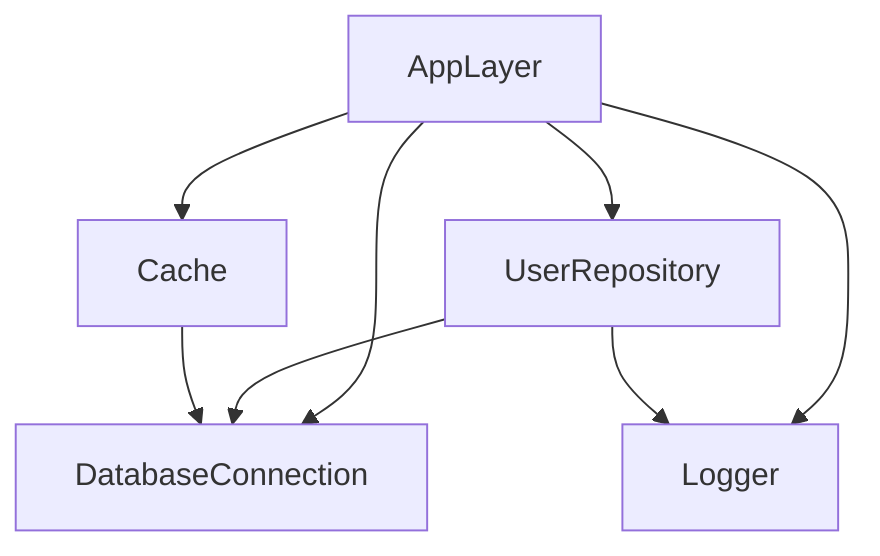

# Effect Office Hours #3: Effect Atom, Ecosystem Tooling & LSP
## Comprehensive Reference Guide

**Source**: Effect Office Hours #3 - Effect Atom, Ecosystem Tooling, LSP
**Format**: Live Demos, Tooling Deep Dive, Q&A
**Focus Areas**: Effect Atom Patterns, Language Service, VSCode Extension, Monorepo Tooling

---

## Table of Contents

1. [Effect Atom: Reactive State Management](#effect-atom-reactive-state-management)
2. [Effect Language Service (LSP) Features](#effect-language-service-lsp-features)
3. [VSCode Extension: Debugging & Observability](#vscode-extension-debugging--observability)
4. [Monorepo Tooling Philosophy](#monorepo-tooling-philosophy)
5. [TypeScript Performance Optimization](#typescript-performance-optimization)
6. [Automatic Layer Composition](#automatic-layer-composition)
7. [Future Tooling Roadmap](#future-tooling-roadmap)
8. [Effect Atom Advanced Patterns](#effect-atom-advanced-patterns)
9. [LSP Configuration & Customization](#lsp-configuration--customization)
10. [Production Debugging Workflows](#production-debugging-workflows)

---

## Effect Atom: Reactive State Management

### What is Effect Atom?

**Definition**: Reactive state management library with deep Effect integration, heavily inspired by Jotai

**Key Characteristics**:
- Atoms are reactive boxes (variables that notify on change)
- Atoms can depend on other Atoms
- Full Effect service integration
- React hooks for consumption
- Automatic dependency tracking

### Basic Counter Example

```typescript
import { Atom } from "@effect/experimental";

// Create simple Atom with initial value
const counterAtom = Atom.make(0);

// React component using Atom
function Counter() {
  // useAtom returns [value, setValue] like useState
  const [count, setCount] = Atom.useAtom(counterAtom);
  
  return (
    <div>
      <p>Count: {count}</p>
      <button onClick={() => setCount(count + 1)}>
        Increment
      </button>
      <button onClick={() => setCount(count - 1)}>
        Decrement
      </button>
    </div>
  );
}
```

**What's Happening**:
1. `Atom.make(0)` creates reactive box with initial value 0
2. `useAtom` hook subscribes component to Atom changes
3. `setCount` updates Atom, triggers re-render
4. Component stays in sync automatically

### Derived Atoms

**Pattern**: Create Atom that depends on another Atom

```typescript
// Base Atom
const counterAtom = Atom.make(0);

// Derived Atom - doubles the counter
const doubledAtom = Atom.make((get) => {
  const count = get(counterAtom);  // Register dependency
  return count * 2;
});

// Use in component
function DerivedExample() {
  const [count, setCount] = Atom.useAtom(counterAtom);
  const doubled = Atom.useAtomValue(doubledAtom);  // Read-only
  
  return (
    <div>
      <p>Count: {count}</p>
      <p>Doubled: {doubled}</p>
      <button onClick={() => setCount(count + 1)}>+</button>
    </div>
  );
}
```

**Key Insight**: Calling `get(counterAtom)` does two things:
1. Gets current value of `counterAtom`
2. Registers `doubledAtom` as dependent on `counterAtom`

**Result**: When `counterAtom` changes, `doubledAtom` automatically recalculates

### Multiple Dependencies

```typescript
const countAtom = Atom.make(10);
const multiplierAtom = Atom.make(2);

// Depends on BOTH atoms
const resultAtom = Atom.make((get) => {
  const count = get(countAtom);
  const multiplier = get(multiplierAtom);
  return count * multiplier;
});

function MultiDependency() {
  const [count, setCount] = Atom.useAtom(countAtom);
  const [multiplier, setMultiplier] = Atom.useAtom(multiplierAtom);
  const result = Atom.useAtomValue(resultAtom);
  
  return (
    <div>
      <p>{count} × {multiplier} = {result}</p>
      <button onClick={() => setCount(count + 1)}>+Count</button>
      <button onClick={() => setMultiplier(multiplier + 1)}>+Multiplier</button>
    </div>
  );
}
```

**Behavior**: `resultAtom` updates when EITHER dependency changes

### Effectful Atoms

**The Killer Feature**: Atoms can execute Effects

```typescript
const countAtom = Atom.make(3);

// Atom that executes Effect
const diceRollsAtom = Atom.make((get) => {
  const count = get(countAtom);
  
  // Return Effect instead of plain value
  return Effect.gen(function* () {
    // Simulate dice rolls (async operation)
    const rolls = [];
    for (let i = 0; i < count; i++) {
      const roll = Math.floor(Math.random() * 6) + 1;
      rolls.push(roll);
      
      // Can include delays, API calls, etc.
      yield* Effect.sleep("100 millis");
    }
    
    return rolls.reduce((a, b) => a + b, 0);
  });
});

function DiceExample() {
  const [count, setCount] = Atom.useAtom(countAtom);
  const diceResult = Atom.useAtomValue(diceRollsAtom);
  
  return (
    <div>
      <p>Rolling {count} dice...</p>
      {Effect.match(diceResult, {
        onLoading: () => <p>Rolling...</p>,
        onFailure: (error) => <p>Error: {error.message}</p>,
        onSuccess: (total) => <p>Total: {total}</p>
      })}
      <button onClick={() => setCount(count + 1)}>Add Die</button>
    </div>
  );
}
```

**States an Effectful Atom Can Be In**:
1. **Loading**: Effect is executing
2. **Success**: Effect completed successfully
3. **Failure**: Effect failed with error

**Pattern**: Use `Effect.match` to handle all states

### Weather API Example

```typescript
const cityAtom = Atom.make("London");

// Fetch weather from API
const weatherAtom = Atom.make((get) => {
  const city = get(cityAtom);
  
  return Effect.gen(function* () {
    // Real API call
    const response = yield* Effect.tryPromise({
      try: () => 
        fetch(`https://api.open-meteo.com/v1/forecast?city=${city}`),
      catch: (error) => new FetchError({ cause: error })
    });
    
    const data = yield* Effect.tryPromise({
      try: () => response.json(),
      catch: (error) => new ParseError({ cause: error })
    });
    
    return {
      temperature: data.current.temperature,
      conditions: data.current.weathercode
    };
  });
});

function Weather() {
  const [city, setCity] = Atom.useAtom(cityAtom);
  const weather = Atom.useAtomValue(weatherAtom);
  
  return (
    <div>
      <input 
        value={city}
        onChange={(e) => setCity(e.target.value)}
      />
      
      {Effect.match(weather, {
        onLoading: () => <p>Loading weather...</p>,
        onFailure: (error) => <p>Failed: {error.message}</p>,
        onSuccess: (data) => (
          <div>
            <p>Temperature: {data.temperature}°C</p>
            <p>Conditions: {data.conditions}</p>
          </div>
        )
      })}
    </div>
  );
}
```

**Benefits**:
- Type-safe error handling
- Loading states automatic
- Retries/timeouts from Effect
- Observability built-in

### Effect Service Integration

**Pattern**: Use Effect services within Atoms

```typescript
// Define service
class TodoService extends Effect.Service<TodoService>()(
  "TodoService",
  {
    effect: Effect.gen(function* () {
      // In-memory implementation
      const todos = new Map<string, Todo>();
      
      return {
        list: () =>
          Effect.sync(() => Array.from(todos.values())),
        
        create: (todo: Todo) =>
          Effect.sync(() => {
            todos.set(todo.id, todo);
            return todo;
          }),
        
        toggle: (id: string) =>
          Effect.gen(function* () {
            const todo = todos.get(id);
            if (!todo) {
              return yield* Effect.fail(new NotFoundError({ id }));
            }
            todo.completed = !todo.completed;
            return todo;
          }),
        
        delete: (id: string) =>
          Effect.sync(() => {
            todos.delete(id);
          })
      };
    })
  }
) {}

// Create Atom runtime with service
const runtime = Atom.runtime((layer) =>
  Layer.provide(layer, TodoService.Default)
);

// Atom that uses service
const todosAtom = runtime.atom((get) =>
  Effect.gen(function* () {
    const todoService = yield* TodoService;
    return yield* todoService.list();
  })
);

// Mutation Atom
const createTodoAtom = runtime.atom((get, set, text: string) =>
  Effect.gen(function* () {
    const todoService = yield* TodoService;
    
    const newTodo = yield* todoService.create({
      id: crypto.randomUUID(),
      text,
      completed: false
    });
    
    // Trigger refresh of todos list
    set(todosAtom, Effect.sync(() => [...get(todosAtom), newTodo]));
    
    return newTodo;
  })
);

// Use in React
function TodoApp() {
  const todos = Atom.useAtomValue(todosAtom);
  const [, createTodo] = Atom.useAtom(createTodoAtom);
  const [input, setInput] = useState("");
  
  const handleCreate = async () => {
    await createTodo(input);
    setInput("");
  };
  
  return (
    <div>
      {Effect.match(todos, {
        onSuccess: (list) => (
          <ul>
            {list.map(todo => (
              <li key={todo.id}>{todo.text}</li>
            ))}
          </ul>
        )
      })}
      
      <input value={input} onChange={(e) => setInput(e.target.value)} />
      <button onClick={handleCreate}>Add</button>
    </div>
  );
}
```

**Key Points**:
1. **Runtime Creation**: `Atom.runtime` with layers
2. **Service Access**: `yield* TodoService` in Atom
3. **Reactivity Keys**: `set` to trigger dependent Atoms
4. **Type Safety**: Full Effect error channel

### Advanced: HTTP API Integration

```typescript
import { HttpApiClient } from "@effect/platform";

// Define HTTP API
const api = HttpApi.make("MyApi").pipe(
  HttpApi.addGroup(
    HttpApiGroup.make("Users").pipe(
      HttpApiGroup.addEndpoint(
        HttpApiEndpoint.get("list", "/users")
          .pipe(HttpApiEndpoint.setSuccess(Schema.Array(UserSchema)))
      ),
      HttpApiGroup.addEndpoint(
        HttpApiEndpoint.post("create", "/users")
          .pipe(
            HttpApiEndpoint.setPayload(CreateUserSchema),
            HttpApiEndpoint.setSuccess(UserSchema)
          )
      )
    )
  )
);

// Client from API definition
const client = HttpApiClient.make(api, {
  baseUrl: "https://api.example.com"
});

// Atom runtime with client
const apiRuntime = Atom.runtime((layer) =>
  Layer.provide(layer, client.Users)
);

// Query Atom
const usersAtom = apiRuntime.atom(() =>
  Effect.gen(function* () {
    const users = yield* client.Users;
    return yield* users.list();
  })
);

// Mutation Atom
const createUserAtom = apiRuntime.atom((get, set, data: CreateUserData) =>
  Effect.gen(function* () {
    const users = yield* client.Users;
    const newUser = yield* users.create(data);
    
    // Optimistic update
    const current = get(usersAtom);
    set(usersAtom, Effect.succeed([...current, newUser]));
    
    return newUser;
  })
);

function Users() {
  const users = Atom.useAtomValue(usersAtom);
  const [, createUser] = Atom.useAtom(createUserAtom);
  
  return Effect.match(users, {
    onLoading: () => <Spinner />,
    onFailure: (error) => <Error message={error.message} />,
    onSuccess: (list) => (
      <div>
        {list.map(user => <UserCard key={user.id} user={user} />)}
        <CreateUserForm onSubmit={createUser} />
      </div>
    )
  });
}
```

**Benefits Over React Query**:
- Type-safe from API definition
- Services beyond HTTP
- Effect error channel
- Observability built-in
- Proper dependency injection

---

## Effect Language Service (LSP) Features

### Installation

```bash
npm install @effect/language-service
```

**tsconfig.json**:

```json
{
  "compilerOptions": {
    "plugins": [
      {
        "name": "@effect/language-service"
      }
    ]
  }
}
```

**VSCode**: Ensure TypeScript uses workspace version
1. Open Command Palette (Cmd/Ctrl + Shift + P)
2. "TypeScript: Select TypeScript Version"
3. Choose "Use Workspace Version"

### Feature 1: Enhanced Hover Information

**Before LSP**:

```typescript
const program = Effect.gen(function* () {
  const user = yield* getUser(123);
  return user;
});

// Hover shows:
// const program: Effect<User, UserError | DatabaseError | NetworkError, UserService>
```

**With LSP**:

```typescript
// Hover shows cleanly formatted:
┌─────────────────────────────────────┐
│ Effect<A, E, R>                     │
├─────────────────────────────────────┤
│ Success: User                       │
│ Errors:                             │
│   • UserError                       │
│   • DatabaseError                   │
│   • NetworkError                    │
│ Requirements:                       │
│   • UserService                     │
└─────────────────────────────────────┘
```

**Benefits**:
- Readable type parameters
- Grouped errors
- Clear requirements
- No overwhelming type complexity

### Feature 2: Layer Visualization

**Code**:

```typescript
const UserRepositoryLayer = Layer.effect(
  UserRepository,
  Effect.gen(function* () {
    const db = yield* DatabaseConnection;
    const logger = yield* Logger;
    return UserRepository.of({ /* ... */ });
  })
);

const AppLayer = Layer.mergeAll(
  UserRepositoryLayer,
  CacheLayer,
  DatabaseConnectionLayer,
  LoggerLayer
);
```

**Hover on `AppLayer`**:

```
┌──────────────────────────────┐
│ Layer Composition            │
├──────────────────────────────┤
│ Provides:                    │
│   • UserRepository           │
│   • Cache                    │
│   • DatabaseConnection       │
│   • Logger                   │
│                              │
│ View Dependency Graph ➜      │
└──────────────────────────────┘
```

**Click "View Dependency Graph"** → Opens Mermaid diagram:



**Alternative: Textual Explanation**:

```
Hover on UserRepository:

"UserRepository is provided by UserRepositoryLayer.
 
 Dependencies:
   • DatabaseConnection (from DatabaseConnectionLayer)
   • Logger (from LoggerLayer)
   
 Required by:
   • AppLayer (line 15, column 3)"
```

**Use Cases**:
- Understand dependency chain
- Debug "service not found" errors
- Visualize layer composition
- Plan refactoring

### Feature 3: Automatic Refactoring

#### Refactor 1: async/await → Effect

**Before**:

```typescript
async function getUserName(id: number): Promise<string> {
  const response = await fetch(`/api/users/${id}`);
  const data = await response.json();
  return data.name;
}
```

**Steps**:
1. Right-click function name
2. Refactor → "Rewrite to Effect.gen with failures"
3. Auto-generates:

```typescript
function getUserName(id: number) {
  return Effect.gen(function* () {
    const response = yield* Effect.tryPromise({
      try: () => fetch(`/api/users/${id}`),
      catch: (error) => new GetUserNameError1({ cause: error })
    });
    
    const data = yield* Effect.tryPromise({
      try: () => response.json(),
      catch: (error) => new GetUserNameError2({ cause: error })
    });
    
    return data.name;
  });
}

class GetUserNameError1 extends Data.TaggedError("GetUserNameError1")<{
  cause: unknown;
}> {}

class GetUserNameError2 extends Data.TaggedError("GetUserNameError2")<{
  cause: unknown;
}> {}
```

**Options**:
- **"with failures"**: Creates typed error classes
- **"with Effect.die"**: Uses defects instead
- **"Effect.all"**: Uses `Effect.all` instead of `gen`

#### Refactor 2: Service Stub Generation

**Before**:

```typescript
export class MyService extends Effect.Service
```

**Type "Service"** → Auto-completion suggests:

```typescript
export class MyService extends Effect.Service<MyService>()(
  "app/services/MyService",  // ← Auto-generated ID
  {
    effect: Effect.gen(function* () {
      return {
        // ← Cursor here
      };
    })
  }
) {}
```

**Auto-generated ID Pattern**:

```
{packageName}/{subfolders}/{fileName}/{serviceName}
```

**Example**:

```
@acme/backend/services/users/UserService.ts

→ "@acme/backend/services/users/UserService"
```

**Benefits**:
- Guaranteed unique IDs
- Consistent naming
- No manual typing

### Feature 4: Diagnostics

#### Diagnostic 1: Missing yield*

**Code**:

```typescript
const program = Effect.gen(function* () {
  Effect.log("Hello");  // ❌ Squiggle
  return "done";
});
```

**Error Message**:

```
Effect must be yielded or assigned to variable

This Effect is not being executed. Did you mean:
  yield* Effect.log("Hello")
```

**Fix**: Add `yield*`

```typescript
const program = Effect.gen(function* () {
  yield* Effect.log("Hello");  // ✅
  return "done";
});
```

#### Diagnostic 2: Missing return yield*

**Code**:

```typescript
const program = Effect.gen(function* () {
  if (error) {
    yield* Effect.fail(new MyError());  // ⚠️ Warning
  }
  
  const user = yield* getUser();  // TypeScript thinks reachable!
  return user;
});
```

**Warning Message**:

```
Use 'return yield*' for Effects that never succeed

This Effect signals a definitive exit point.
Use 'return yield*' for proper type narrowing.

Suggested fix:
  return yield* Effect.fail(new MyError());
```

**Fix**:

```typescript
const program = Effect.gen(function* () {
  if (error) {
    return yield* Effect.fail(new MyError());  // ✅
  }
  
  const user = yield* getUser();  // Now correctly typed
  return user;
});
```

**Benefits**:
- Proper type narrowing
- Unreachable code detection
- Better compiler inference

#### Diagnostic 3: Deterministic Service IDs (Optional)

**Enable in settings**:

```json
{
  "effect.languageService.diagnostics": {
    "deterministicServiceKey": "error"
  }
}
```

**Code**:

```typescript
export class MyService extends Effect.Service<MyService>()(
  "MyService",  // ❌ Not deterministic
  { /* ... */ }
) {}
```

**Error**:

```
Service identifier should follow pattern:
  {package}/{path}/{file}/{name}

Expected: "app/services/MyService"
Found: "MyService"
```

**Fix**: Use auto-completion to generate correct ID

### Feature 5: Smart Rename

**Code**:

```typescript
class UserError extends Data.TaggedError("UserError")<{
  userId: number;
}> {}

const program = Effect.fail(new UserError({ userId: 123 }));
```

**Rename class** → LSP updates tag automatically:

```typescript
class UserNotFoundError extends Data.TaggedError("UserNotFoundError")<{
  userId: number;
}> {}

const program = Effect.fail(new UserNotFoundError({ userId: 123 }));
```

**Benefits**:
- Tag stays in sync with class name
- No manual updates needed
- Prevents mismatches

### Feature 6: Local Mermaid Rendering (Privacy)

**Concern**: Don't want to send code to external services

**Solution**: Install `mermaid-viewer` extension

**Usage**:
1. Hover layer
2. Click "Show Layer Mermaid Locally"
3. Opens in VSCode tab (not external)

**Settings**:

```json
{
  "effect.languageService.noExternalServices": true
}
```

**Result**: All visualizations stay local

---

## VSCode Extension: Debugging & Observability

### Installation

```bash
code --install-extension effectful.effect-vscode
```

### Feature 1: Effect Span Stack

**Problem**: Normal call stack shows Effect internals, not business logic

**Normal Stack**:

```
at Function.next (<anonymous>)
at GeneratorFunctionPrototype.next (<anonymous>)
at step (/node_modules/effect/dist/cjs/internal/core.js:123)
at fulfill (/node_modules/effect/dist/cjs/internal/core.js:456)
at Promise.resolve.then (/node_modules/effect/dist/cjs/internal/core.js:789)
```

**Effect Span Stack** (in VSCode panel):

```
┌────────────────────────────────────┐
│ Effect Span Stack                  │
├────────────────────────────────────┤
│ ▸ getUserById                      │
│   src/services/UserService.ts:45   │
│                                    │
│ ▸ handleGetUserRequest             │
│   src/api/users.ts:23              │
│                                    │
│ ▸ main                             │
│   src/index.ts:12                  │
└────────────────────────────────────┘
```

**Usage**:
1. Set breakpoint in code
2. Run debugger
3. View "Effect Span Stack" panel
4. Click span → Jump to code

**Benefits**:
- See actual business logic flow
- Ignore Effect internals
- Clickable source locations
- Understand execution path

### Feature 2: Fiber Inspector

**View All Running Fibers**:

```
┌─────────────────────────────────────────────────┐
│ Effect Fibers                                   │
├─────────────────────────────────────────────────┤
│ Fiber #0 [Running]                              │
│   Span: getUserById                             │
│   Interruptible: Yes                            │
│   Actions: [Interrupt]                          │
│                                                 │
│ Fiber #1 [Suspended]                            │
│   Span: backgroundSync                          │
│   Interruptible: No                             │
│   Actions: [Inspect]                            │
│                                                 │
│ Fiber #2 [Done]                                 │
│   Span: processQueue                            │
│   Result: Success                               │
└─────────────────────────────────────────────────┘
```

**Information Shown**:
- Fiber ID
- Current state (Running, Suspended, Done)
- Active span name
- Interruptibility status
- Available actions

**Interruptibility Indicator**:
- ✅ **Yes**: Can be interrupted
- ❌ **No**: `Effect.uninterruptible` wrapper

**Use Cases**:
- Debug hanging fibers
- Find non-interruptible operations
- Test interruption handling
- Understand concurrency

### Feature 3: Manual Fiber Interruption

**Scenario**: Test interruption behavior

**Steps**:
1. Set breakpoint before `Effect.sleep`
2. Run debugger → hits breakpoint
3. Open Effect Fibers panel
4. Click fiber → "Interrupt"
5. Resume debugger

**Code**:

```typescript
const program = Effect.gen(function* () {
  console.log("Starting");
  
  yield* Effect.sleep("10 seconds");  // ← Breakpoint here
  
  console.log("After sleep");  // Never reached if interrupted
}).pipe(
  Effect.ensuring(
    Console.log("Cleanup")  // ← Jumps here on interrupt
  )
);
```

**Result**: Execution jumps to `ensuring` finalizer

**Benefits**:
- Test interruption paths
- Verify cleanup logic
- Find interruption bugs
- Understand fiber lifecycle

### Feature 4: Context Inspector

**View Current Context**:

```
┌─────────────────────────────────────┐
│ Effect Context                      │
├─────────────────────────────────────┤
│ DatabaseConnection                  │
│   host: "localhost"                 │
│   port: 5432                        │
│   pool: [Object]                    │
│                                     │
│ Logger                              │
│   level: "info"                     │
│   format: "json"                    │
│                                     │
│ RequestContext                      │
│   userId: 123                       │
│   tenantId: "acme"                  │
│   requestId: "req_abc123"           │
└─────────────────────────────────────┘
```

**Use Cases**:
- Verify services provided
- Check request context
- Debug dependency injection
- Inspect service state

### Feature 5: Embedded Tracer

**Real-Time Trace Visualization**:

**Steps**:
1. Set breakpoint in code
2. Run debugger
3. Open "Effect Tools" panel
4. Click "Attach Debug Connection"
5. Resume program

**Tracer View**:

```
┌──────────────────────────────────────────────┐
│ Effect Tracer                                │
├──────────────────────────────────────────────┤
│ main (5.2s)                                  │
│ ├─ getUserById (1.2s)                        │
│ │  ├─ query (800ms)                          │
│ │  └─ validateUser (400ms)                   │
│ ├─ getPermissions (2.1s)                     │
│ │  └─ query (2.0s)                           │
│ └─ auditLog (1.8s)                           │
│    └─ kafkaSend (1.7s)                       │
└──────────────────────────────────────────────┘
```

**Benefits Over External Telemetry**:
- **Immediate**: See spans in real-time
- **No Setup**: No telemetry backend needed
- **Local**: All data stays in editor
- **Fast**: No network latency

**Production Telemetry**:

```typescript
// Still use OpenTelemetry for production
const program = myEffect.pipe(
  Effect.withSpan("myOperation"),
  Effect.provide(OpenTelemetryLayer)
);
```

### Feature 6: Pause on Defects

**Enable**:

```
☑ Pause on Defects
```

**Code**:

```typescript
const program = Effect.gen(function* () {
  yield* Effect.die(new Error("Something terrible"));
  
  return "never reached";
});
```

**Behavior**: Debugger pauses at `Effect.die` automatically

**Debug Panel Shows**:

```
┌────────────────────────────────────┐
│ Defect Detected                    │
├────────────────────────────────────┤
│ Type: Defect                       │
│ Error: Error: Something terrible   │
│                                    │
│ Location:                          │
│   src/index.ts:23                  │
└────────────────────────────────────┘
```

**Use Cases**:
- Catch unexpected failures
- Debug schema validation failures
- Find defects in testing
- Understand error propagation

---

## Monorepo Tooling Philosophy

### The Effect Approach: Minimal Tooling

**Core Principle**: Use native tools, avoid bloat

### Effect-TS/effect (Main Repo)

**Build Setup**:

```json
{
  "scripts": {
    "build": "tsc --build",
    "build:watch": "tsc --build --watch"
  }
}
```

**Why Just TypeScript**:
1. **Library Code**: No bundling needed
2. **Type Declarations**: TSC generates `.d.ts` files
3. **Native Support**: No abstraction layer
4. **Fast**: No extra processing

**What We Don't Use**:
- ❌ Webpack
- ❌ Rollup
- ❌ Vite
- ❌ tsup
- ❌ Turbo Repo
- ❌ Nx

**Why Not**:
- Unnecessary for libraries
- Added complexity
- Maintenance burden
- Slower builds

### Effect-TS/effect-smol (Effect 4.0)

**Key Changes**:
1. **ESM Only**: No CommonJS support
2. **Erasable Syntax**: Type-only TypeScript
3. **Optimized**: Smaller bundles

**Build Setup** (still minimal):

```json
{
  "scripts": {
    "build": "tsc --build",
    "build:watch": "tsc --build --watch"
  },
  "type": "module"
}
```

**Babel for Annotations**:

```json
{
  "plugins": [
    ["babel-plugin-effect-annotations", {
      // Inject metadata for Effect features
    }]
  ]
}
```

**Why ESM Only**:
- Modern JavaScript
- Better tree-shaking
- Smaller bundles
- Native module support

### Erasable Syntax Only

**tsconfig.json**:

```json
{
  "compilerOptions": {
    "verbatimModuleSyntax": true  // Enforce erasable syntax
  }
}
```

**What This Means**:

**✅ Allowed (Erasable)**:

```typescript
// Type-only imports
import type { User } from "./types";

// Type-only exports
export type { User } from "./types";

// Interfaces
interface Service {
  method(): void;
}

// Type aliases
type Result = Success | Failure;

// Declare namespace (type-only)
declare namespace MyLib {
  type Config = { /* ... */ };
}
```

**❌ Forbidden (Not Erasable)**:

```typescript
// Namespace with values
namespace MyLib {
  export const VERSION = "1.0.0";  // Runtime value
}

// Enums (compile to objects)
enum Status {
  Active,
  Inactive
}

// Use const enum or union types instead
type Status = "Active" | "Inactive";
```

**Why Erasable Syntax**:
- Can run directly with Node.js (no transpilation)
- Faster development
- Simpler tooling
- Modern JavaScript standard

### Application vs Library Tooling

**For Libraries (Effect Pattern)**:
- TypeScript compiler only
- pnpm workspaces
- No bundler needed
- Type declarations required

**For Applications**:
- Bundling recommended (Vite, Webpack, etc.)
- Tree-shaking important
- Minification useful
- Code splitting helpful

**Example Application Setup**:

```json
{
  "scripts": {
    "dev": "vite",
    "build": "vite build",
    "preview": "vite preview"
  },
  "dependencies": {
    "effect": "^3.0.0"
  },
  "devDependencies": {
    "vite": "^5.0.0",
    "@vitejs/plugin-react": "^4.0.0"
  }
}
```

### Why Not Turbo Repo or Nx?

**Turbo Repo/Nx Features**:
- Caching
- Task orchestration
- Distributed builds
- Complex dependency graphs

**Why Effect Doesn't Need Them**:
1. **Simple Dependency Graph**: Linear, not complex
2. **Fast Builds**: TypeScript alone is fast enough
3. **Low Overhead**: Native tools sufficient
4. **Maintenance**: Less to maintain

**When You Might Need Them**:
- Many interconnected packages
- Slow build times
- Complex task dependencies
- Large organization

### Package Manager: pnpm

**Why pnpm**:
- Disk space efficient
- Fast installations
- Strict dependency resolution
- Workspaces support

**Workspace Setup**:

```yaml
# pnpm-workspace.yaml
packages:
  - "packages/*"
```

**Root package.json**:

```json
{
  "private": true,
  "scripts": {
    "build": "pnpm -r build",
    "test": "pnpm -r test"
  }
}
```

---

## TypeScript Performance Optimization

### Common Performance Issues

**Symptoms**:
- Slow IntelliSense
- Long compile times
- Editor lag
- High memory usage

### Solution 1: Project References

**Split into smaller projects**:

```json
// packages/core/tsconfig.json
{
  "compilerOptions": {
    "composite": true,
    "outDir": "./dist",
    "rootDir": "./src"
  },
  "include": ["src"]
}
```

```json
// packages/api/tsconfig.json
{
  "compilerOptions": {
    "composite": true
  },
  "references": [
    { "path": "../core" }
  ]
}
```

```json
// tsconfig.json (root)
{
  "files": [],
  "references": [
    { "path": "./packages/core" },
    { "path": "./packages/api" }
  ]
}
```

**Build**:

```bash
tsc --build
```

**Benefits**:
- Incremental compilation
- Parallel builds
- Smaller type-checking scope
- Faster IntelliSense

### Solution 2: Explicit Type Annotations

**Problem**: TypeScript infers complex types

```typescript
// ❌ Slow: TypeScript must infer everything
const AppLayer = Layer.mergeAll(
  ServiceA.Default,
  ServiceB.Default,
  ServiceC.Default
).pipe(
  Layer.provide(DatabaseLayer),
  Layer.provide(LoggerLayer)
);
```

**Solution**: Annotate complex return types

```typescript
// ✅ Fast: TypeScript knows the type
const AppLayer: Layer.Layer<
  ServiceA | ServiceB | ServiceC,
  never,
  never
> = Layer.mergeAll(
  ServiceA.Default,
  ServiceB.Default,
  ServiceC.Default
).pipe(
  Layer.provide(DatabaseLayer),
  Layer.provide(LoggerLayer)
);
```

**LSP Helper**: Right-click → "Annotate with Inferred Type"

### Solution 3: Isolated Modules

**Enable in tsconfig.json**:

```json
{
  "compilerOptions": {
    "isolatedModules": true
  }
}
```

**What It Does**:
- Enforces module-level isolation
- Prevents cross-file inference
- Requires explicit exports

**Example**:

```typescript
// ❌ Error with isolatedModules
export const user = { name: "Alice" };  // Implicit type

// ✅ OK: Explicit annotation
export const user: User = { name: "Alice" };
```

**Benefits**:
- Faster compilation
- Better caching
- Parallel type-checking

### Solution 4: SkipLibCheck

**Enable**:

```json
{
  "compilerOptions": {
    "skipLibCheck": true
  }
}
```

**What It Does**: Skip type-checking of `.d.ts` files in node_modules

**Benefits**:
- Much faster compilation
- Fewer type errors from dependencies
- Better DX

**Tradeoff**: Miss some type errors in dependencies

### Solution 5: Incremental Compilation

**Enable**:

```json
{
  "compilerOptions": {
    "incremental": true,
    "tsBuildInfoFile": ".tsbuildinfo"
  }
}
```

**What It Does**: Cache type information between builds

**Benefits**:
- Faster subsequent builds
- Only recompile changed files

---

## Automatic Layer Composition

### The Manual Pain

**Code**:

```typescript
const DatabaseLayer = Layer.succeed(Database, /* ... */);
const LoggerLayer = Layer.succeed(Logger, /* ... */);
const CacheLayer = Layer.effect(Cache, /* ... */);  // depends on Database
const UserRepositoryLayer = Layer.effect(UserRepository, /* ... */);  // depends on Database + Logger

// Manual composition (error-prone)
const AppLayer = Layer.mergeAll(
  DatabaseLayer,
  LoggerLayer
).pipe(
  Layer.provideMerge(CacheLayer),
  Layer.provideMerge(UserRepositoryLayer)
);
```

**Problems**:
- Error-prone
- Manual dependency tracking
- Tedious to update

### LSP Solution: Automatic Composition

**Step 1: Prepare Layers**

```typescript
// Put all layers in array
const layers = [
  DatabaseLayer,
  LoggerLayer,
  CacheLayer,
  UserRepositoryLayer,
  FileSystemLayer
] as const;
```

**Step 2: Right-click → "Prepare layers for automatic composition"**

```typescript
const AppLayer = [
  DatabaseLayer,        // ✓ Keep
  LoggerLayer,          // ✓ Keep
  CacheLayer,           // ✓ Keep
  UserRepositoryLayer,  // ✓ Keep
  // FileSystemLayer,   // ✗ Remove (don't need)
] as const;
```

**Step 3: Right-click → "Compose layers automatically"**

```typescript
// Auto-generated!
const AppLayer = UserRepositoryLayer.pipe(
  Layer.provide(CacheLayer),
  Layer.provide(LoggerLayer),
  Layer.provide(DatabaseLayer)
);

// Type: Layer<UserRepository | Cache | Logger | Database, never, never>
```

**Benefits**:
- Correct dependency order
- Type-safe
- Handles complex graphs
- Saves time

### How It Works

**Algorithm**:
1. **Parse Dependencies**: Read Requirements channel of each layer
2. **Topological Sort**: Order by dependencies
3. **Generate Code**: Create provide chain

**Example**:

```
Input layers:
  A: ∅ → ServiceA
  B: ∅ → ServiceB
  C: ServiceA → ServiceC
  D: ServiceB + ServiceC → ServiceD

Topological sort:
  1. A, B (no dependencies)
  2. C (depends on A)
  3. D (depends on B, C)

Generated code:
  D.pipe(
    Layer.provide(C),
    Layer.provide(B),
    Layer.provide(A)
  )
```

### Partial Composition

**Scenario**: Some dependencies not provided

```typescript
const AppLayer = [
  UserRepositoryLayer,
  CacheLayer
  // Missing: DatabaseLayer
] as const;
```

**Auto-compose**:

```typescript
const AppLayer = UserRepositoryLayer.pipe(
  Layer.provide(CacheLayer)
);

// Type: Layer<UserRepository | Cache, never, Database>
//                                              ^^^^^^^^
//                                              Still required!
```

**LSP Warning**: "Missing requirements: Database"

### Local vs Remote Mermaid

**Default**: Opens mermaid.live (external)

**Privacy Concern**: Code structure sent to external service

**Solution**: Install `mermaid-viewer` extension

**Settings**:

```json
{
  "effect.languageService.noExternalServices": true
}
```

**Now**: Command Palette → "Show Layer Mermaid Locally"

**Result**: Renders in VSCode, nothing sent externally

---

## Future Tooling Roadmap

### 1. MCP Server for Effect

**MCP**: Model Context Protocol (AI integration)

**Goal**: Let AI understand Effect codebases

**Features**:
- Query: "Where is UserError defined?"
- Query: "What are requirements at line 45?"
- Query: "Suggest fix for service not found"
- Navigate: Follow dependency chains
- Suggest: Apply LSP diagnostics

**Example**:

```
AI: I need to understand the error types in this function.

MCP: getUserById (line 23) can fail with:
  • UserNotFoundError (defined at src/errors.ts:12)
  • DatabaseError (defined at src/errors.ts:45)
  
  Requirements:
  • Database (from DatabaseService)
  • Logger (from LoggerService)
  
  Suggested fix for missing service:
  Add Layer.provide(DatabaseService.Default)
```

**Benefits**:
- Better AI code generation
- Fewer errors
- Faster development

### 2. Editor-Agnostic DevTools

**Current**: VSCode extension only

**Goal**: Desktop app + Chrome DevTools extension

**Features**:
- Standalone Electron app
- Chrome DevTools panel
- React Native debugging
- Remote debugging

**Architecture**:

```
┌─────────────────┐
│ Effect App      │
│ (Node/Browser)  │
└────────┬────────┘
         │ Debug Protocol
         ▼
┌─────────────────┐
│ DevTools Core   │
│ (Platform-free) │
└────────┬────────┘
         │
    ┌────┴────┐
    ▼         ▼
┌─────────┐ ┌──────────────┐
│ Desktop │ │ Chrome Panel │
│ App     │ │              │
└─────────┘ └──────────────┘
```

**Benefits**:
- Use any editor
- Browser debugging
- Mobile app debugging
- Consistent experience

### 3. Debugger Proxy

**Concept**: Middleware between debugger and JS engine

**Architecture**:

```
┌──────────┐      ┌───────────────┐      ┌──────────┐
│ VSCode   │◄────►│ Debug Proxy   │◄────►│ Node.js  │
│ Debugger │      │ (Middleware)  │      │ App      │
└──────────┘      └───────────────┘      └──────────┘
```

**Features**:
- **Step by Span**: Step through business logic, not JS
- **Skip Internals**: Never step into Effect core
- **Smart Breakpoints**: Break on span entry/exit
- **Fiber Stepping**: Step across fibers

**Example**:

```typescript
const program = Effect.gen(function* () {
  yield* Effect.log("Start");     // Breakpoint 1
  
  yield* Effect.sleep("1 second");  // Skip internals
  
  yield* doWork();                 // Breakpoint 2
}).pipe(
  Effect.withSpan("main")
);
```

**Debugging**:
1. Set breakpoint at "Start"
2. Click "Step Over" → Goes to `doWork()`, skips `sleep` internals
3. Click "Step Into" → Enters `doWork` span

**Challenge**: Requires intercepting debug protocol

**Status**: Experimental, may not work out

### 4. Enhanced LSP Features

**Planned**:
- **Auto-import Services**: Suggest imports for missing services
- **Layer Suggestions**: "You need DatabaseLayer, add it?"
- **Error Quick Fixes**: Convert `throw` to `Effect.fail`
- **Refactor Service**: Extract to separate file

**Example Quick Fix**:

```typescript
function getUser(id: number): User {
  if (!db.has(id)) {
    throw new Error("Not found");  // ⚠️ Quick fix available
  }
  return db.get(id);
}
```

**Quick Fix**:

```typescript
function getUser(id: number): Effect.Effect<User, NotFoundError> {
  return Effect.gen(function* () {
    if (!db.has(id)) {
      return yield* Effect.fail(new NotFoundError({ id }));
    }
    return db.get(id);
  });
}
```

---

## Effect Atom Advanced Patterns

### Pattern 1: Optimistic Updates

```typescript
const todosAtom = runtime.atom(() =>
  Effect.gen(function* () {
    const api = yield* ApiService;
    return yield* api.getTodos();
  })
);

const createTodoAtom = runtime.atom((get, set, text: string) =>
  Effect.gen(function* () {
    const api = yield* ApiService;
    
    // Optimistic: Add immediately
    const tempId = `temp-${Date.now()}`;
    const optimistic = {
      id: tempId,
      text,
      completed: false
    };
    
    const current = get(todosAtom);
    set(todosAtom, Effect.succeed([...current, optimistic]));
    
    // Actual API call
    try {
      const created = yield* api.createTodo(text);
      
      // Replace temp with real
      const updated = get(todosAtom).map(t =>
        t.id === tempId ? created : t
      );
      set(todosAtom, Effect.succeed(updated));
      
      return created;
    } catch (error) {
      // Rollback on failure
      const reverted = get(todosAtom).filter(t => t.id !== tempId);
      set(todosAtom, Effect.succeed(reverted));
      
      return yield* Effect.fail(error);
    }
  })
);
```

### Pattern 2: Pagination

```typescript
const pageAtom = Atom.make(1);
const pageSizeAtom = Atom.make(20);

const usersPageAtom = runtime.atom((get) =>
  Effect.gen(function* () {
    const api = yield* ApiService;
    const page = get(pageAtom);
    const pageSize = get(pageSizeAtom);
    
    return yield* api.getUsers({
      page,
      pageSize
    });
  })
);

function UserList() {
  const [page, setPage] = Atom.useAtom(pageAtom);
  const users = Atom.useAtomValue(usersPageAtom);
  
  return (
    <div>
      {Effect.match(users, {
        onSuccess: (data) => (
          <>
            {data.items.map(u => <UserCard key={u.id} user={u} />)}
            
            <Pagination
              current={page}
              total={data.total}
              onChange={setPage}
            />
          </>
        )
      })}
    </div>
  );
}
```

### Pattern 3: Infinite Scroll

```typescript
const infiniteUsersAtom = runtime.atom((get) => {
  // State: accumulated users
  const [users, setUsers] = useState<User[]>([]);
  const [page, setPage] = useState(1);
  
  return Effect.gen(function* () {
    const api = yield* ApiService;
    
    const newUsers = yield* api.getUsers({ page });
    
    // Append to existing
    setUsers([...users, ...newUsers.items]);
    
    return {
      users: [...users, ...newUsers.items],
      hasMore: newUsers.hasMore,
      loadMore: () => setPage(page + 1)
    };
  });
});

function InfiniteUserList() {
  const data = Atom.useAtomValue(infiniteUsersAtom);
  
  return Effect.match(data, {
    onSuccess: ({ users, hasMore, loadMore }) => (
      <div>
        {users.map(u => <UserCard key={u.id} user={u} />)}
        
        {hasMore && (
          <button onClick={loadMore}>Load More</button>
        )}
      </div>
    )
  });
}
```

### Pattern 4: Dependent Queries

```typescript
const selectedUserIdAtom = Atom.make<number | null>(null);

const selectedUserAtom = runtime.atom((get) => {
  const userId = get(selectedUserIdAtom);
  
  if (userId === null) {
    return Effect.succeed(null);
  }
  
  return Effect.gen(function* () {
    const api = yield* ApiService;
    return yield* api.getUser(userId);
  });
});

const userPostsAtom = runtime.atom((get) => {
  const user = get(selectedUserAtom);
  
  if (user === null) {
    return Effect.succeed([]);
  }
  
  return Effect.gen(function* () {
    const api = yield* ApiService;
    return yield* api.getUserPosts(user.id);
  });
});

function UserProfile() {
  const user = Atom.useAtomValue(selectedUserAtom);
  const posts = Atom.useAtomValue(userPostsAtom);
  
  return (
    <div>
      {Effect.match(user, {
        onSuccess: (u) => u && (
          <>
            <h1>{u.name}</h1>
            
            {Effect.match(posts, {
              onSuccess: (list) => (
                <ul>
                  {list.map(p => <li key={p.id}>{p.title}</li>)}
                </ul>
              )
            })}
          </>
        )
      })}
    </div>
  );
}
```

---

## LSP Configuration & Customization

### Configuration File

**Location**: `.vscode/settings.json` or User Settings

```json
{
  "effect.languageService": {
    // Diagnostic severity
    "diagnostics": {
      "unyieldedEffect": "error",
      "missingReturnYield": "warning",
      "deterministicServiceKey": "off"
    },
    
    // Features
    "enableLayerVisualization": true,
    "enableRefactors": true,
    "enableCompletions": true,
    
    // Privacy
    "noExternalServices": false,
    
    // Service ID pattern
    "serviceIdPattern": "{package}/{path}/{file}/{name}"
  }
}
```

### Diagnostic Severities

**Options**: `"off"` | `"hint"` | `"information"` | `"warning"` | `"error"`

**Example**:

```json
{
  "effect.languageService.diagnostics": {
    // Enforce return yield*
    "missingReturnYield": "error",
    
    // Warn about unyielded Effects
    "unyieldedEffect": "warning",
    
    // Don't enforce deterministic keys
    "deterministicServiceKey": "off"
  }
}
```

### Custom Service ID Pattern

**Default**: `{package}/{path}/{file}/{name}`

**Example**:

```
Package: @acme/backend
File: src/services/users/UserService.ts
Service: UserService

→ "@acme/backend/services/users/UserService"
```

**Custom Pattern**:

```json
{
  "effect.languageService.serviceIdPattern": "{package}/{name}"
}
```

**Result**: `"@acme/backend/UserService"`

### Disable External Services

**Why**: Privacy concerns, enterprise policies

```json
{
  "effect.languageService.noExternalServices": true
}
```

**Effect**:
- No mermaid.live links
- Use local mermaid viewer
- All processing stays local

---

## Production Debugging Workflows

### Workflow 1: Investigating Hung Fiber

**Symptom**: Request never completes

**Steps**:
1. Attach debugger to process
2. Pause execution
3. Open "Effect Fibers" panel
4. Look for suspicious fibers

**Findings**:

```
Fiber #3 [Running]
  Span: waitForResponse
  Interruptible: No  ← Problem!
  Duration: 5m 32s
```

**Analysis**: Non-interruptible operation blocking

**Fix**:

```typescript
// Before
const program = Effect.uninterruptible(
  Effect.all([
    longOperation1,
    longOperation2
  ])
);

// After: Make interruptible
const program = Effect.all([
  longOperation1,
  longOperation2
]);
```

### Workflow 2: Tracing Slow Request

**Symptom**: Request takes 10 seconds

**Steps**:
1. Set breakpoint at request handler
2. Run debugger
3. Open "Effect Tools" → Tracer
4. Step through execution

**Findings**:

```
handleRequest (10.2s)
├─ validateAuth (0.1s)
├─ getUser (0.2s)
├─ getPermissions (9.8s)  ← Problem!
│  ├─ query1 (5.1s)
│  └─ query2 (4.7s)
└─ renderResponse (0.1s)
```

**Analysis**: Sequential queries should be parallel

**Fix**:

```typescript
// Before: Sequential
const program = Effect.gen(function* () {
  const query1Result = yield* query1;
  const query2Result = yield* query2;
  return [query1Result, query2Result];
});

// After: Parallel
const program = Effect.all([query1, query2], { concurrency: "unbounded" });
```

### Workflow 3: Testing Interruption

**Scenario**: Verify cleanup on cancellation

**Steps**:
1. Set breakpoint in operation
2. Run debugger
3. Click fiber → "Interrupt"
4. Step through cleanup code

**Verify**:
- `Effect.ensuring` runs
- Resources released
- State consistent

---

## Summary: Key Takeaways

### Effect Atom
1. **Reactive State**: Atoms notify dependents automatically
2. **Effectful**: Can execute Effects with loading states
3. **Services**: Deep integration with Effect services
4. **Type-Safe**: Full Effect error channel

### Language Service
1. **Enhanced Hover**: Readable type information
2. **Layer Visualization**: Understand dependencies
3. **Auto-Refactoring**: async/await → Effect
4. **Diagnostics**: Catch common mistakes
5. **Smart Rename**: Keep tags in sync

### VSCode Extension
1. **Span Stack**: See business logic, not internals
2. **Fiber Inspector**: View all running fibers
3. **Manual Interruption**: Test cancellation
4. **Context Inspector**: Verify DI
5. **Embedded Tracer**: Real-time spans

### Monorepo Tooling
1. **Minimal**: TypeScript + pnpm only
2. **Library Code**: No bundler needed
3. **ESM Only**: Modern JavaScript (v4)
4. **Erasable Syntax**: Run without transpilation

### Performance
1. **Project References**: Incremental builds
2. **Type Annotations**: Help TypeScript
3. **Isolated Modules**: Module-level checking
4. **Skip Lib Check**: Faster compilation

### Future
1. **MCP Server**: AI integration
2. **Editor-Agnostic**: Desktop + Chrome
3. **Debugger Proxy**: Step by spans
4. **Enhanced LSP**: More quick fixes

---

## Resources & References

### Official Documentation
- Effect Atom: https://effect.website/docs/ecosystem/atom
- Language Service: https://github.com/Effect-TS/language-service
- VSCode Extension: https://marketplace.visualstudio.com/items?itemName=effectful.effect-vscode

### Community
- Discord: https://discord.gg/effect-ts
- Office Hours: Weekly (Discord announcements)
- GitHub: https://github.com/Effect-TS/effect

### Demos
- Effect Atom Examples: (Link to Kit's demos)
- Visual Effect Tools: (Link to visual tools)

### Related Videos
- Effect Atom Tutorial: Ethan Niser
- LSP Deep Dive: Mattia Manzati
- DevTools Overview: Effect Days 2024

---

*This reference captures Effect Office Hours #3 covering Effect Atom patterns, comprehensive LSP features, VSCode debugging tools, and production tooling philosophy. These tools dramatically improve the Effect development experience.*
