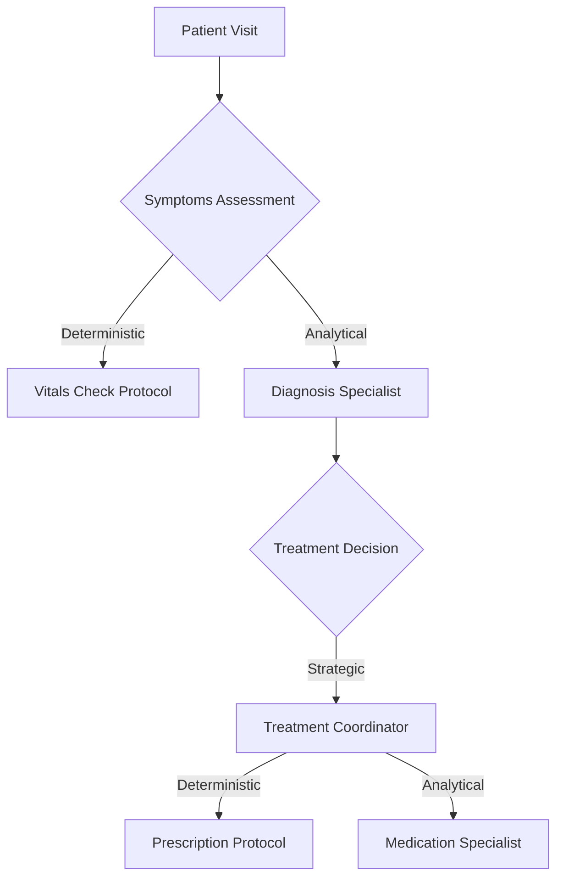

# Design Pipeline for Event-Driven Actor Model Agents

## Overview: The Six-Phase Approach

```
Phase 1: Domain Analysis & Decomposition
   ↓
Phase 2: Actor Architecture Design
   ↓
Phase 3: Event & Communication Design
   ↓
Phase 4: State/Tool/Model Specification
   ↓
Phase 5: Implementation & Integration
   ↓
Phase 6: Learning & Optimization
```

---

## Phase 1: Domain Analysis & Decomposition

**Goal**: Understand the domain deeply enough to identify natural expertise boundaries

### Stage 1.1: Domain Mapping

**Activities**:

1. **Identify Domain Boundaries**

   ```
   Questions to answer:
   - What is the scope of this system?
   - What are we optimizing for?
   - What decisions need to be made?
   - What expertise is required?
   ```

2. **Map the Decision Landscape**

   ```
   Create a decision inventory:
   - Strategic decisions (high-level, infrequent)
   - Tactical decisions (medium-level, regular)
   - Operational decisions (low-level, frequent)
   - Automated actions (deterministic)
   ```

3. **Identify Knowledge Domains**

   ```
   For each type of decision, identify:
   - What expertise is needed?
   - What specialized knowledge?
   - What accumulated experience matters?
   - What patterns need recognition?
   ```

**Deliverable**: Domain Map

```markdown
# Domain Map Example: Healthcare System

## Scope
Patient care coordination for chronic disease management

## Key Decisions
### Strategic
- Treatment plan selection
- Care pathway determination
- Resource allocation

### Tactical  
- Medication adjustments
- Specialist referrals
- Test ordering

### Operational
- Appointment scheduling
- Medication reminders
- Vitals monitoring

## Knowledge Domains Required
- Clinical diagnosis (disease-specific)
- Pharmacology (drug interactions, dosing)
- Patient psychology (adherence, motivation)
- Care coordination (scheduling, handoffs)
- Resource management (availability, optimization)
```

---

### Stage 1.2: Process Flow Analysis

**Activities**:

1. **Map Current Workflows**

   ```
   Document existing processes:
   - What triggers actions?
   - What steps are taken?
   - Who/what makes decisions?
   - What information is needed?
   - What are the outputs?
   ```

2. **Identify Decision Points**

   ```
   For each workflow:
   - Where is judgment required?
   - Where are rules applied?
   - Where does expertise matter?
   - Where is optimization needed?
   ```

3. **Classify Decision Types**

   ```
   Deterministic (rule-based):
   - Clear criteria
   - No judgment needed
   - Compliance-driven
   
   Analytical (expertise-based):
   - Pattern recognition
   - Context interpretation
   - Trade-off evaluation
   
   Strategic (experience-based):
   - Long-term implications
   - Multiple factors
   - Accumulated wisdom
   ```

**Deliverable**: Process Flow Diagram with Decision Classification



---

### Stage 1.3: Expertise Identification

**Activities**:

1. **Identify Natural Specializations**

   ```
   Look for:
   - Bounded domains of knowledge
   - Accumulated expertise that matters
   - Clear success metrics
   - Meaningful learning opportunities
   ```

2. **Validate Specialization Boundaries**

   ```
   For each potential specialization, ask:
   - Does this have a lifecycle?
   - Does experience improve outcomes?
   - Is there accumulated state?
   - Can this learn and improve?
   - Is this irreplaceable expertise?
   ```

3. **Identify Dependencies**

   ```
   Map how specializations interact:
   - What information flows between them?
   - What coordination is needed?
   - What conflicts might arise?
   - What shared resources exist?
   ```

**Deliverable**: Expertise Domain Catalog

```yaml
expertise_domains:
  - name: "Cardiovascular Diagnosis Specialist"
    scope: "Heart disease diagnosis and monitoring"
    lifecycle: "Patient lifetime with condition"
    learns_from: "Diagnostic outcomes, treatment responses"
    success_metric: "Diagnostic accuracy, early detection"
    dependencies: ["Lab Results", "Imaging", "Treatment Coordinator"]
    
  - name: "Medication Management Specialist"
    scope: "Drug therapy optimization"
    lifecycle: "Treatment duration"
    learns_from: "Side effects, efficacy, interactions"
    success_metric: "Treatment adherence, outcome improvement"
    dependencies: ["Diagnosis Specialist", "Lab Results", "Pharmacy"]
    
  - name: "Patient Care Coordinator"
    scope: "Overall patient journey and care plan"
    lifecycle: "Patient relationship"
    learns_from: "Treatment outcomes, patient preferences"
    success_metric: "Patient satisfaction, health outcomes"
    dependencies: ["All Specialists", "Scheduling", "Resources"]
```

---

### Stage 1.4: Event & Trigger Identification

**Activities**:

1. **Identify System-Level Events**

   ```
   Critical events that MUST trigger response:
   - Compliance deadlines
   - Safety thresholds
   - Regulatory requirements
   - Resource constraints
   - External mandates
   ```

2. **Identify Domain Events**

   ```
   Events within each expertise domain:
   - State changes
   - Milestones reached
   - Anomalies detected
   - Opportunities emerged
   - Patterns completed
   ```

3. **Classify Event Criticality**

   ```
   CRITICAL: Immediate response required
   HIGH: Response within defined SLA
   MEDIUM: Response when convenient
   LOW: Batch processing acceptable
   ```

**Deliverable**: Event Catalog

```yaml
system_events:
  - event: "Patient_Vitals_Critical"
    criticality: CRITICAL
    trigger: "Any vital sign outside critical range"
    must_notify: ["Care Coordinator", "On-Call Physician", "Emergency Response"]
    sla: "Immediate"
    
  - event: "Lab_Results_Available"
    criticality: HIGH
    trigger: "Lab completes tests"
    must_notify: ["Ordering Physician", "Relevant Specialists"]
    sla: "Within 4 hours"
    
  - event: "Medication_Due"
    criticality: MEDIUM
    trigger: "Scheduled medication time"
    must_notify: ["Medication Management", "Nursing Staff"]
    sla: "Within 30 minutes"

domain_events:
  - event: "Pattern_Detected"
    domain: "Diagnosis Specialist"
    criticality: HIGH
    trigger: "Symptom pattern matches known condition"
    agent_defined: true
    
  - event: "Treatment_Milestone"
    domain: "Care Coordinator"
    criticality: MEDIUM
    trigger: "30 days on treatment"
    agent_defined: true
```

---

### Phase 1 Validation Checklist

Before proceeding to Phase 2:

- [ ] Domain boundaries clearly defined
- [ ] All major decision types identified
- [ ] Natural expertise specializations found
- [ ] Each specialization has meaningful lifecycle
- [ ] Dependencies between domains mapped
- [ ] Critical events identified
- [ ] Success metrics defined per domain
- [ ] Stakeholders reviewed and approved domain map

**Deliverables Package**:
1. Domain Map Document
2. Process Flow Diagrams
3. Expertise Domain Catalog
4. Event Catalog
5. Decision Classification Matrix

---

## Phase 2: Actor Architecture Design

**Goal**: Design the actor hierarchy and responsibilities

### Stage 2.1: Actor Identification

**Activities**:

1. **Map Expertise Domains to Actors**

   ```
   For each expertise domain identified in Phase 1:
   
   Actor Name: [Domain Name] Actor
   Pattern: [Specialist/Coordinator/Guardian/Executor/Integrator]
   Expertise: [What this actor knows deeply]
   Responsibility: [What this actor is accountable for]
   Lifecycle: [When created, how long exists, when terminated]
   ```

2. **Validate Actor Design**

   ```
   For each proposed actor, verify:
   ✓ Maps to persistent expertise domain (not just a function)
   ✓ Has meaningful state that accumulates
   ✓ Can learn and improve over time
   ✓ Has clear success metrics
   ✓ Cannot be easily replaced by simple rules
   ✓ Bounded context window requirements (< 25K tokens)
   ```

3. **Identify Missing Actors**

   ```
   Look for gaps:
   - Who coordinates across specialists?
   - Who handles edge cases?
   - Who monitors system health?
   - Who manages resources?
   - Who handles escalations?
   ```

**Deliverable**: Actor Specification Sheet

```yaml
actors:
  - name: "Cardiovascular_Specialist_Actor"
    pattern: "Specialist"
    expertise: "Cardiovascular disease diagnosis and monitoring"
    responsibilities:
      - "Diagnose heart conditions from symptoms and tests"
      - "Monitor disease progression"
      - "Recommend diagnostic procedures"
      - "Identify risk factors and complications"
    
    lifecycle:
      created: "When patient shows cardiac symptoms"
      persists: "Throughout patient's cardiac care"
      terminated: "When cardiac condition resolved or patient discharged"
    
    success_metrics:
      - "Diagnostic accuracy"
      - "Early detection rate"
      - "False positive rate"
      - "Time to diagnosis"
    
    learns_from:
      - "Diagnostic outcomes"
      - "Test result patterns"
      - "Treatment response"
    
    estimated_context_size: "12-15K tokens"
    
  - name: "Patient_Care_Coordinator_Actor"
    pattern: "Coordinator"
    expertise: "Overall patient care strategy and coordination"
    responsibilities:
      - "Develop and maintain care plan"
      - "Coordinate between specialists"
      - "Make treatment strategy decisions"
      - "Manage patient relationship"
    
    lifecycle:
      created: "Patient admission"
      persists: "Entire patient relationship"
      terminated: "Patient discharge or transfer"
    
    success_metrics:
      - "Patient health outcomes"
      - "Care plan adherence"
      - "Patient satisfaction"
      - "Coordination efficiency"
    
    learns_from:
      - "Treatment plan outcomes"
      - "Patient preferences and responses"
      - "Specialist recommendations effectiveness"
    
    estimated_context_size: "20-25K tokens"
```

---

### Stage 2.2: Actor Hierarchy & Communication Design

**Activities**:

1. **Define Actor Relationships**

   ```
   For each pair of actors:
   - What information flows between them?
   - Who initiates communication?
   - What triggers communication?
   - What is the expected response?
   ```

2. **Design Coordination Patterns**

   ```
   Identify coordination patterns:
   
   Request-Response:
   Actor A requests → Actor B analyzes → Actor B responds
   
   Event Notification:
   Actor A detects event → Notify Actor B → Actor B decides
   
   Workflow Handoff:
   Actor A completes → Hand off to Actor B → Continue process
   
   Collaborative Analysis:
   Actor A + Actor B both analyze → Synthesize → Decision
   ```

3. **Identify Conflict Resolution**

   ```
   What happens when actors disagree?
   - Priority hierarchy (e.g., Safety > Optimization)
   - Escalation to coordinator
   - Human-in-the-loop
   - Voting/consensus
   ```

**Deliverable**: Actor Communication Matrix

```yaml
communication_patterns:
  - from: "Cardiovascular_Specialist"
    to: "Care_Coordinator"
    type: "Signal"
    trigger: "Diagnosis completed or pattern detected"
    payload: "Diagnosis, confidence, recommended actions"
    expected_response: "Treatment decision"
    
  - from: "Care_Coordinator"
    to: "Medication_Specialist"
    type: "Request"
    trigger: "Treatment plan requires drug therapy"
    payload: "Diagnosis, patient profile, treatment goals"
    expected_response: "Medication recommendation"
    
  - from: "Lab_Results_System"
    to: ["Cardiovascular_Specialist", "Care_Coordinator"]
    type: "Event"
    trigger: "Critical lab value"
    payload: "Lab results, criticality flag"
    expected_response: "Acknowledgment and assessment"

conflict_resolution:
  - actors: ["Medication_Specialist", "Renal_Specialist"]
    conflict: "Drug contraindicated by kidney function"
    resolution: "Renal_Specialist has priority (safety)"
    
  - actors: ["Care_Coordinator", "Resource_Manager"]
    conflict: "Recommended treatment not available"
    resolution: "Escalate to Supervisor for resource allocation"
```

---

### Stage 2.3: Responsibility Mapping

**Activities**:

1. **Define Clear Boundaries**

   ```
   For each decision or action in the system:
   - Which actor is responsible?
   - Which actors must be consulted?
   - Which actors must be informed?
   - Who has final authority?
   ```

2. **Create RACI Matrix**

   ```
   RACI = Responsible, Accountable, Consulted, Informed
   
   For each key process:
   - R: Who does the work?
   - A: Who is ultimately accountable?
   - C: Who must be consulted?
   - I: Who must be informed?
   ```

3. **Validate No Gaps or Overlaps**

   ```
   Check:
   - Every critical task has exactly one Responsible actor
   - Every critical task has exactly one Accountable actor
   - No orphaned responsibilities
   - No conflicting authority
   ```

**Deliverable**: Responsibility Matrix

```yaml
responsibilities:
  - task: "Diagnose cardiac condition"
    responsible: "Cardiovascular_Specialist"
    accountable: "Cardiovascular_Specialist"
    consulted: ["Care_Coordinator"]
    informed: ["Care_Team"]
    
  - task: "Decide treatment plan"
    responsible: "Care_Coordinator"
    accountable: "Care_Coordinator"
    consulted: ["Cardiovascular_Specialist", "Medication_Specialist"]
    informed: ["Patient", "Care_Team"]
    
  - task: "Execute medication order"
    responsible: "Medication_Execution_Actor"
    accountable: "Medication_Specialist"
    consulted: []
    informed: ["Care_Coordinator", "Nursing_Staff"]
```

---

### Phase 2 Validation Checklist

- [ ] Each actor maps to persistent expertise domain
- [ ] No "orchestrator" or pure routing actors
- [ ] Each actor has clear, bounded responsibilities
- [ ] Communication patterns defined for all actor pairs
- [ ] Conflict resolution mechanisms identified
- [ ] No responsibility gaps or overlaps
- [ ] Context window budgets reasonable (<25K each)
- [ ] Total system context budget manageable

**Deliverables Package**:
1. Actor Specification Sheets (one per actor)
2. Actor Communication Matrix
3. Responsibility Matrix (RACI)
4. Actor Hierarchy Diagram
5. Conflict Resolution Protocols

---

## Phase 3: Event & Communication Design

**Goal**: Design the event system and message protocols

### Stage 3.1: Event Architecture

**Activities**:

1. **Design System-Level Event Registry**

   ```yaml
   system_events:
     - event_id: "CRITICAL_VITAL_SIGN"
       description: "Patient vital sign outside critical range"
       trigger_condition: "systolic_bp > 180 OR < 90, etc."
       priority: "CRITICAL"
       mandatory_recipients: ["Care_Coordinator", "Emergency_Response"]
       sla: "Immediate"
       cannot_be_disabled: true
       
     - event_id: "COMPLIANCE_DEADLINE_APPROACHING"
       description: "Regulatory deadline in 7 days"
       trigger_condition: "deadline_date - today <= 7 days"
       priority: "HIGH"
       mandatory_recipients: ["Responsible_Actor", "Compliance_Monitor"]
       sla: "4 hours"
       cannot_be_disabled: true
   ```

2. **Design Agent-Defined Event API**

   ```python
   # API for actors to set dynamic alerts
   actor.set_alert(
       alert_id: str,              # Unique identifier
       condition: Expression,       # Boolean condition
       actions: List[Action],       # What to do when triggered
       priority: Priority,          # HIGH/MEDIUM/LOW
       ttl: Optional[DateTime],     # How long to monitor
       reasoning: str               # Why this alert matters
   )
   
   # Condition expression language
   Condition = {
       "type": "threshold" | "pattern" | "composite",
       "parameters": {...}
   }
   ```

3. **Design Event Routing Logic**

   ```python
   def route_event(event):
       # 1. Classify event
       priority = classify_priority(event)
       category = classify_category(event)
       
       # 2. Determine recipients
       if priority == "CRITICAL":
           recipients = get_mandatory_recipients(event)
           delivery = "IMMEDIATE"
       else:
           recipients = get_interested_actors(event)
           delivery = "BATCH" if priority == "LOW" else "NORMAL"
       
       # 3. Route with proper handling
       for recipient in recipients:
           deliver_event(
               event=event,
               recipient=recipient,
               delivery_mode=delivery,
               timeout=get_timeout(priority)
           )
   ```

**Deliverable**: Event Architecture Document

---

### Stage 3.2: Message Protocol Design

**Activities**:

1. **Define Message Structure**

   ```yaml
   message_schema:
     required_fields:
       - message_id: "Unique identifier"
       - from_actor: "Sender actor ID"
       - to_actor: "Recipient actor ID"
       - message_type: "REQUEST|RESPONSE|EVENT|COMMAND"
       - priority: "CRITICAL|HIGH|MEDIUM|LOW"
       - timestamp: "ISO 8601 format"
       - payload: "Message content"
     
     optional_fields:
       - correlation_id: "For request-response pairing"
       - requires_response: "Boolean"
       - timeout_ms: "Expected response time"
       - retry_policy: "How to handle failures"
   ```

2. **Define Message Types**

   ```yaml
   message_types:
     REQUEST:
       description: "Actor needs something from another actor"
       requires_response: true
       example: "Care Coordinator requests diagnosis from Specialist"
       
     RESPONSE:
       description: "Reply to a REQUEST"
       requires_response: false
       must_include: "correlation_id"
       example: "Specialist returns diagnosis to Care Coordinator"
       
     EVENT:
       description: "Notification of something that happened"
       requires_response: false
       example: "Lab results available"
       
     COMMAND:
       description: "Directive to perform action"
       requires_response: true (acknowledgment)
       example: "Execute medication order"
   ```

3. **Design Payload Structures**

   ```yaml
   payload_templates:
     diagnosis_signal:
       diagnosis:
         condition: "string"
         confidence: "float (0-1)"
         supporting_evidence: "list"
       recommendations:
         - action: "string"
           priority: "string"
           reasoning: "string"
       
     treatment_request:
       patient_id: "string"
       diagnosis: "diagnosis object"
       treatment_goals: "list"
       constraints: "list"
       urgency: "string"
   ```

**Deliverable**: Message Protocol Specification

---

### Stage 3.3: Communication Patterns

**Activities**:

1. **Document Standard Patterns**

   ```yaml
   patterns:
     synchronous_request_response:
       description: "Actor blocks waiting for response"
       use_when: "Response needed for immediate decision"
       timeout: "Define per use case"
       example: "Request drug interaction check before prescribing"
       
     asynchronous_event:
       description: "Fire and forget notification"
       use_when: "Recipients act independently"
       example: "Lab results available - multiple actors notified"
       
     workflow_handoff:
       description: "Sequential actor involvement"
       use_when: "Process has defined stages"
       example: "Diagnosis → Treatment Plan → Execution"
       
     collaborative_analysis:
       description: "Multiple actors contribute to decision"
       use_when: "Complex decision needs multiple perspectives"
       example: "Multiple specialists contribute to treatment plan"
   ```

2. **Design Flow Examples**

   ```
   Example: Patient with chest pain
   
   3. EVENT: "Patient_Symptom_Reported"
      → Triage_Actor (assesses severity)
      
   4. COMMAND: "Initiate_Assessment"
      → Cardiovascular_Specialist
      
   5. REQUEST: "Order_ECG"
      → Diagnostic_Coordinator
      
   6. EVENT: "ECG_Complete"
      → Cardiovascular_Specialist
      
   7. REQUEST: "Diagnosis_Assessment"
      → Care_Coordinator
      
   8. RESPONSE: "Diagnosis_Result"
      ← Cardiovascular_Specialist
      
   9. REQUEST: "Treatment_Recommendation"
      → Medication_Specialist
      
   10. COMMAND: "Execute_Treatment_Plan"
      → Execution_Actor
   ```

**Deliverable**: Communication Pattern Catalog with Examples

---

### Phase 3 Validation Checklist

- [ ] All critical events identified with mandatory handlers
- [ ] Agent-defined event API designed and documented
- [ ] Message schema defined with all required fields
- [ ] Message types cover all communication needs
- [ ] Payload structures defined for common messages
- [ ] Standard communication patterns documented
- [ ] Example flows mapped for key scenarios
- [ ] Timeout and retry policies defined

**Deliverables Package**:
1. Event Architecture Document
2. Message Protocol Specification
3. Communication Pattern Catalog
4. Message Flow Diagrams (key scenarios)
5. Event Routing Logic Specification

---

## Phase 4: State/Tool/Model Specification

**Goal**: Design what lives in state, tools, and model weights for each actor

### Stage 4.1: Actor State Design

**Activities**:

1. **For Each Actor, Define State Schema**

   ```yaml
   actor: "Cardiovascular_Specialist"
   
   state_schema:
     # CURRENT STATUS (ground truth)
     current_context:
       patient_id: "string"
       monitoring_since: "datetime"
       current_condition: "string"
       stability: "stable|declining|improving"
       
     # IMMEDIATE INDICATORS
     current_vitals:
       heart_rate: "integer"
       blood_pressure: "string"
       ejection_fraction: "float"
       last_updated: "datetime"
       
     # SHORT-TERM MEMORY (last 3-5)
     recent_observations:
       - date: "datetime"
         finding: "string"
         significance: "string"
       # ... max 5 items
       
     # ACTIVE MONITORING
     watching:
       current_concerns:
         - concern: "string"
           since: "datetime"
           severity: "string"
           trigger_if: "condition"
       
     # CURRENT BELIEFS
     working_diagnosis:
       primary: "string"
       confidence: "float"
       differential: ["list"]
       supporting_evidence: ["list"]
       last_updated: "datetime"
   ```

2. **Validate State Contents**

   ```
   For each state field, verify:
   ✓ Represents current value (not historical)
   ✓ Actually used in decision-making
   ✓ Cannot be computed on-demand
   ✓ Size bounded and reasonable
   ✓ Updated regularly (not stale)
   
   Red flags:
   ✗ "all_past_observations" - use tool instead
   ✗ "success_rate" - goes in model weights
   ✗ "historical_patterns" - goes in model
   ✗ Unbounded lists (use recent + count)
   ```

3. **Estimate State Size**

   ```
   Calculate token count for each actor's state:
   - Current context: ~500 tokens
   - Recent memory: ~1000 tokens (5 items)
   - Active monitoring: ~500 tokens
   - Current beliefs: ~1000 tokens
   Total: ~3000 tokens
   
   Target: Keep under 5K tokens for specialists
           Keep under 25K for coordinators
   ```

**Deliverable**: Actor State Specifications (one per actor)

---

### Stage 4.2: Tool Design

**Activities**:

1. **Identify Required Tools per Actor**

   ```yaml
   actor: "Cardiovascular_Specialist"
   
   tools:
     - name: "find_similar_patient_cases"
       purpose: "Get similar cases for pattern matching"
       category: "Historical Query"
       
     - name: "calculate_risk_scores"
       purpose: "Compute cardiovascular risk metrics"
       category: "Analytics"
       
     - name: "simulate_treatment_outcomes"
       purpose: "Predict outcomes of treatment options"
       category: "Simulation"
       
     - name: "get_latest_guidelines"
       purpose: "Retrieve current clinical guidelines"
       category: "External Data"
       
     - name: "detect_ecg_patterns"
       purpose: "Analyze ECG for known patterns"
       category: "Pattern Detection"
   ```

2. **Design Tool Interfaces**

   ```python
   def find_similar_patient_cases(
       demographics: Dict,
       symptoms: List[str],
       test_results: Dict,
       limit: int = 5
   ) -> SimilarCasesResult:
       """
       Find similar patient cases for pattern matching.
       
       Returns insights, not raw data:
       - Similar cases with outcomes
       - Common diagnoses and success rates
       - Treatment approaches that worked
       - Complications to watch for
       """
       return SimilarCasesResult(
           similar_cases=[...],  # Top matches
           common_diagnoses={    # Pre-analyzed
               "diagnosis": "name",
               "frequency": 0.65,
               "typical_outcome": "good"
           },
           effective_treatments=[...],
           watch_for=[...],
           confidence=0.85
       )
   ```

3. **Specify Tool Outputs**

   ```yaml
   tool: "find_similar_patient_cases"
   
   output_schema:
     similar_cases:
       type: "array"
       max_items: 5  # Bounded!
       items:
         patient_id: "string (anonymized)"
         similarity_score: "float"
         diagnosis: "string"
         treatment: "string"
         outcome: "string"
         
     common_diagnoses:
       type: "object"
       description: "Pre-computed statistics"
       
     confidence: "float"
     
   output_size: "~2000 tokens"  # Estimate
   ```

**Deliverable**: Tool Specifications (per actor)

---

### Stage 4.3: Model Weights Planning

**Activities**:

1. **Identify What Should Be Learned**

   ```yaml
   actor: "Cardiovascular_Specialist"
   
   model_components:
     pattern_recognition:
       what: "Recognize diagnostic patterns from symptoms/tests"
       type: "Neural network classifier"
       inputs: "Symptoms, test results, demographics"
       outputs: "Likely diagnoses with confidence"
       training_signal: "Actual diagnosis outcomes"
       
     risk_stratification:
       what: "Optimal risk assessment thresholds"
       type: "Regression model"
       inputs: "Patient factors, test results"
       outputs: "Risk scores, severity classification"
       training_signal: "Actual patient outcomes"
       
     diagnostic_strategy:
       what: "Which tests to order when"
       type: "Policy network"
       inputs: "Current information state"
       outputs: "Next diagnostic action"
       training_signal: "Time to diagnosis, cost, accuracy"
       
     confidence_calibration:
       what: "When to be confident vs uncertain"
       type: "Calibration model"
       inputs: "Diagnosis, supporting evidence"
       outputs: "Calibrated confidence score"
       training_signal: "Actual diagnostic accuracy"
   ```

2. **Define Learning Objectives**

   ```yaml
   learning_objectives:
     - metric: "Diagnostic accuracy"
       target: ">90%"
       measurement: "Correct diagnosis in top-3 predictions"
       
     - metric: "Early detection"
       target: "Improve by 20%"
       measurement: "Days from presentation to diagnosis"
       
     - metric: "False positive rate"
       target: "<5%"
       measurement: "Unnecessary interventions triggered"
       
     - metric: "Resource efficiency"
       target: "Reduce by 15%"
       measurement: "Number of tests to reach diagnosis"
   ```

3. **Plan Initial vs. Learned**

   ```yaml
   initial_deployment:
     pattern_recognition: "Rule-based heuristics"
     risk_stratification: "Standard clinical scores (ASCVD, etc.)"
     diagnostic_strategy: "Protocol-based guidelines"
     confidence_calibration: "Fixed thresholds"
     
   learning_path:
     phase_1: "Collect trajectories (3 months)"
     phase_2: "Train pattern recognition (offline)"
     phase_3: "A/B test learned models (10% traffic)"
     phase_4: "Gradual rollout if improved"
     phase_5: "Continuous learning and refinement"
   ```

**Deliverable**: Model Architecture Specifications (per actor)

---

### Stage 4.4: Context Window Budgeting

**Activities**:

1. **Calculate Per-Actor Budgets**

   ```yaml
   actor: "Cardiovascular_Specialist"
   
   context_budget:
     state: 3000 tokens
     system_prompt: 500 tokens
     task_description: 500 tokens
     tool_results: 2000 tokens (when called)
     reasoning_space: 6000 tokens
     total_max: 12000 tokens
     
   status: "WITHIN BUDGET (< 15K target)"
   ```

2. **Optimize Large Actors**

   ```
   If actor exceeds budget:
   
   Option 1: Compress state
   - Summarize older events
   - Keep only critical context
   - Use references instead of full data
   
   Option 2: Split actor
   - Is this really one expertise domain?
   - Could it be 2+ specialized actors?
   
   Option 3: Reduce tool output size
   - Return only top-N results
   - Increase pre-computation
   - Better filtering
   ```

3. **System-Wide Budget**

   ```yaml
   total_system_budget:
     simple_actors: 10 × 5K = 50K
     specialist_actors: 5 × 12K = 60K
     coordinator_actors: 2 × 22K = 44K
     total: 154K tokens
     
   available_context: 200K tokens (Claude)
   margin: 46K tokens (23%)
   status: "ACCEPTABLE"
   ```

**Deliverable**: Context Window Budget Analysis

---

### Phase 4 Validation Checklist

- [ ] State schemas defined for all actors
- [ ] No historical data in state (use tools)
- [ ] No statistics in state (use models)
- [ ] State size estimated and reasonable
- [ ] Tools designed with bounded outputs
- [ ] Tool interfaces clearly specified
- [ ] Model components identified
- [ ] Learning objectives defined
- [ ] Context budgets calculated
- [ ] System-wide budget acceptable

**Deliverables Package**:
1. Actor State Specifications (per actor)
2. Tool Specifications (per actor)
3. Model Architecture Plans (per actor)
4. Context Window Budget Analysis
5. Initial vs. Learned Capability Plan

---

## Phase 5: Implementation & Integration

**Goal**: Build and integrate the system

### Stage 5.1: Infrastructure Setup

**Activities**:

1. **Set Up Core Infrastructure**

   ```yaml
   infrastructure_components:
     message_bus:
       type: "Event-driven message broker"
       requirements: ["Priority queues", "Correlation tracking", "Timeout handling"]
       technology: "RabbitMQ / Kafka / Redis Streams"
       
     actor_runtime:
       type: "Actor framework"
       requirements: ["State persistence", "Supervision", "Isolation"]
       technology: "Akka / Orleans / Custom"
       
     llm_orchestration:
       type: "LLM API management"
       requirements: ["Rate limiting", "Retry logic", "Cost tracking"]
       technology: "LangChain / Custom wrapper"
       
     state_storage:
       type: "Actor state persistence"
       requirements: ["Fast read/write", "Transactional", "Queryable"]
       technology: "PostgreSQL / MongoDB / Redis"
       
     tool_execution:
       type: "Function execution engine"
       requirements: ["Sandboxing", "Timeout", "Result caching"]
       technology: "AWS Lambda / Kubernetes Jobs"
   ```

2. **Implement Core Abstractions**

   ```python
   class Actor:
       def __init__(self, actor_id, actor_type, state_schema):
           self.id = actor_id
           self.type = actor_type
           self.state = self.load_state()
           self.tools = self.load_tools()
           self.model = self.load_model()
       
       async def receive_message(self, message):
           """Handle incoming message"""
           pass
       
       async def make_decision(self, context):
           """Core decision-making with LLM"""
           pass
       
       def update_state(self, updates):
           """Update and persist state"""
           pass
       
       async def call_tool(self, tool_name, params):
           """Execute tool and return results"""
           pass
   ```

3. **Implement Message Router**

   ```python
   class EventRouter:
       def __init__(self):
           self.system_events = load_system_events()
           self.actor_registry = load_actor_registry()
       
       async def route_event(self, event):
           # Classify and route
           priority = self.classify_priority(event)
           recipients = self.determine_recipients(event)
           
           for recipient in recipients:
               await self.deliver(
                   event=event,
                   recipient=recipient,
                   priority=priority
               )
       
       async def deliver(self, event, recipient, priority):
           # Handle delivery with appropriate urgency
           pass
   ```

**Deliverable**: Core Infrastructure Implementation

---

### Stage 5.2: Actor Implementation

**Activities**:

1. **Implement Base Actor Class**

   ```python
   class BaseActor:
       """Base class all actors inherit from"""
       
       def __init__(self, config):
           self.id = config.id
           self.type = config.type
           self.state = ActorState(config.state_schema)
           self.tools = ToolRegistry(config.tools)
           self.model = ModelWrapper(config.model)
           self.message_queue = MessageQueue()
       
       async def run(self):
           """Main actor loop"""
           while True:
               message = await self.message_queue.get()
               await self.handle_message(message)
       
       async def handle_message(self, message):
           """Dispatch message to appropriate handler"""
           if message.type == "EVENT":
               await self.on_event(message)
           elif message.type == "REQUEST":
               await self.on_request(message)
           elif message.type == "COMMAND":
               await self.on_command(message)
       
       async def make_decision(self, context, task):
           """Core LLM-based decision making"""
           # Build prompt from context
           prompt = self.build_prompt(context, task)
           
           # Call LLM with model guidance
           response = await self.model.generate(
               prompt=prompt,
               temperature=self.config.temperature,
               max_tokens=self.config.max_tokens
           )
           
           # Parse and validate response
           decision = self.parse_decision(response)
           
           # Update state
           self.update_state_after_decision(decision)
           
           return decision
       
       def build_prompt(self, context, task):
           """Build prompt with state + context + task"""
           return f"""
           You are a {self.type} actor with expertise in {self.expertise}.
           
           Your current state:
           {self.state.to_context()}
           
           Current situation:
           {context}
           
           Task:
           {task}
           
           Based on your expertise and accumulated experience, what should you do?
           """
       
       async def call_tool(self, tool_name, params):
           """Execute tool"""
           tool = self.tools.get(tool_name)
           result = await tool.execute(params)
           return result
       
       def update_state(self, updates):
           """Update actor state"""
           self.state.update(updates)
           self.state.persist()
   ```

2. **Implement Specialized Actors**

   ```python
   class CardiovascularSpecialist(BaseActor):
       """Cardiovascular diagnosis specialist"""
       
       def __init__(self, config):
           super().__init__(config)
           self.expertise = "Cardiovascular disease diagnosis"
       
       async def on_event(self, event):
           """Handle events specific to cardiology"""
           if event.type == "SYMPTOMS_REPORTED":
               await self.assess_symptoms(event.payload)
           elif event.type == "TEST_RESULTS":
               await self.analyze_test_results(event.payload)
       
       async def assess_symptoms(self, symptoms):
           """Cardiovascular-specific symptom assessment"""
           
           # Build context with current state
           context = f"""
           Patient: {self.state.patient_id}
           Current condition: {self.state.current_condition}
           Recent observations: {self.state.recent_observations}
           
           New symptoms: {symptoms}
           """
           
           # Call tool for similar cases
           similar = await self.call_tool(
               "find_similar_patient_cases",
               {"symptoms": symptoms}
           )
           
           # Make assessment with LLM
           assessment = await self.make_decision(
               context=f"{context}\n\nSimilar cases: {similar}",
               task="assess_cardiovascular_significance"
           )
           
           # Update state
           self.state.recent_observations.append({
               "date": now(),
               "finding": assessment.finding,
               "significance": assessment.significance
           })
           
           # If significant, notify coordinator
           if assessment.significance == "HIGH":
               await self.send_message(
                   to="Care_Coordinator",
                   type="SIGNAL",
                   payload=assessment
               )
           
           return assessment
   ```

3. **Implement Deterministic Workflows**

   ```python
   class WorkflowEngine:
       """Execute deterministic workflows"""
       
       def __init__(self):
           self.workflows = load_workflows()
       
       async def execute(self, workflow_name, context):
           """Execute workflow by name"""
           workflow = self.workflows[workflow_name]
           
           for step in workflow.steps:
               if step.type == "DETERMINISTIC":
                   result = await self.execute_deterministic_step(step, context)
               elif step.type == "LLM_DECISION":
                   result = await self.execute_llm_step(step, context)
               
               # Check conditions for next step
               if not self.check_conditions(step.conditions, result):
                   break
               
               context.update(result)
           
           return context
       
       async def execute_deterministic_step(self, step, context):
           """Execute rule-based step"""
           return step.function(context)
       
       async def execute_llm_step(self, step, context):
           """Execute LLM reasoning step"""
           actor = self.get_actor(step.actor)
           return await actor.make_decision(context, step.task)
   ```

**Deliverable**: Actor Implementation Code

---

### Stage 5.3: Integration & Testing

**Activities**:

1. **Unit Test Each Actor**

   ```python
   class TestCardiovascularSpecialist:
       """Test cardiovascular specialist actor"""
       
       async def test_symptom_assessment(self):
           # Setup
           actor = CardiovascularSpecialist(test_config)
           symptoms = {"chest_pain": True, "duration": "30min"}
           
           # Execute
           assessment = await actor.assess_symptoms(symptoms)
           
           # Verify
           assert assessment is not None
           assert "significance" in assessment
           assert actor.state.recent_observations[-1]["finding"] == assessment.finding
       
       async def test_tool_calling(self):
           # Test that actor calls tools correctly
           pass
       
       async def test_state_updates(self):
           # Test state management
           pass
   ```

2. **Integration Test Actor Pairs**

   ```python
   class TestActorCommunication:
       """Test communication between actors"""
       
       async def test_specialist_to_coordinator(self):
           # Setup
           specialist = CardiovascularSpecialist(config)
           coordinator = CareCoordinator(config)
           
           # Execute: Specialist sends signal
           assessment = create_test_assessment()
           await specialist.send_message(
               to="Care_Coordinator",
               type="SIGNAL",
               payload=assessment
           )
           
           # Verify: Coordinator receives and processes
           message = await coordinator.message_queue.get()
           assert message.type == "SIGNAL"
           assert message.payload == assessment
       
       async def test_request_response_pattern(self):
           # Test request-response communication
           pass
   ```

3. **End-to-End Scenario Tests**

   ```python
   class TestCompleteScenarios:
       """Test complete workflows"""
       
       async def test_chest_pain_diagnosis_flow(self):
           """
           Test complete flow:
           1. Patient reports chest pain
           2. Triage assesses urgency
           3. Cardiovascular specialist diagnoses
           4. Care coordinator decides treatment
           5. Medication specialist recommends drugs
           6. Execution actor implements plan
           """
           # Setup all actors
           system = create_test_system()
           
           # Trigger initial event
           await system.emit_event({
               "type": "SYMPTOMS_REPORTED",
               "patient_id": "TEST001",
               "symptoms": {"chest_pain": True}
           })
           
           # Wait for flow to complete
           await system.wait_for_completion(timeout=30)
           
           # Verify outcomes
           coordinator = system.get_actor("Care_Coordinator")
           assert coordinator.state.treatment_plan is not None
           
           execution = system.get_actor("Execution_Actor")
           assert execution.state.executed_actions is not None
   ```

**Deliverable**: Test Suite with Coverage Report

---

### Stage 5.4: Observability & Monitoring

**Activities**:

1. **Implement Logging**

   ```python
   class ActorLogger:
       """Structured logging for actors"""
       
       def log_decision(self, actor_id, context, decision, reasoning):
           log.info({
               "event": "decision_made",
               "actor_id": actor_id,
               "context": context,
               "decision": decision,
               "reasoning": reasoning,
               "timestamp": now()
           })
       
       def log_message(self, message):
           log.info({
               "event": "message_sent",
               "from": message.from_actor,
               "to": message.to_actor,
               "type": message.type,
               "correlation_id": message.correlation_id,
               "timestamp": now()
           })
       
       def log_tool_call(self, actor_id, tool, params, result, duration):
           log.info({
               "event": "tool_called",
               "actor_id": actor_id,
               "tool": tool,
               "params": params,
               "result_summary": summarize(result),
               "duration_ms": duration,
               "timestamp": now()
           })
   ```

2. **Implement Metrics**

   ```python
   class ActorMetrics:
       """Metrics collection for actors"""
       
       def __init__(self):
           self.metrics = MetricsRegistry()
       
       def record_decision_latency(self, actor_id, latency_ms):
           self.metrics.histogram(
               "actor.decision.latency",
               latency_ms,
               tags={"actor_id": actor_id}
           )
       
       def record_tool_call(self, actor_id, tool_name, success):
           self.metrics.counter(
               "actor.tool.calls",
               tags={"actor_id": actor_id, "tool": tool_name, "success": success}
           )
       
       def record_message_sent(self, from_actor, to_actor, message_type):
           self.metrics.counter(
               "actor.messages.sent",
               tags={"from": from_actor, "to": to_actor, "type": message_type}
           )
   ```

3. **Implement Dashboards**

   ```yaml
   dashboards:
     actor_health:
       metrics:
         - "Message processing rate per actor"
         - "Decision latency per actor"
         - "Error rate per actor"
         - "Tool call success rate"
       
     system_health:
       metrics:
         - "Total message throughput"
         - "End-to-end scenario completion time"
         - "Active actors count"
         - "Message queue depths"
       
     business_metrics:
       metrics:
         - "Decisions per hour"
         - "Success rate by decision type"
         - "Average time to resolution"
         - "Resource utilization"
   ```

**Deliverable**: Observability Infrastructure

---

### Phase 5 Validation Checklist

- [ ] Core infrastructure implemented and tested
- [ ] Message routing working correctly
- [ ] All actors implemented
- [ ] Actor state persistence working
- [ ] Tool execution working
- [ ] Deterministic workflows implemented
- [ ] Unit tests passing (>80% coverage)
- [ ] Integration tests passing
- [ ] End-to-end scenarios working
- [ ] Logging comprehensive
- [ ] Metrics collecting
- [ ] Dashboards operational

**Deliverables Package**:
1. Implemented System Code
2. Test Suite with Coverage Report
3. Observability Infrastructure
4. Deployment Documentation
5. Operations Runbook

---

## Phase 6: Learning & Optimization

**Goal**: Enable actors to learn and improve over time

### Stage 6.1: Trajectory Collection

**Activities**:

1. **Implement Trajectory Capture**

   ```python
   class TrajectoryCollector:
       """Collect state-action-outcome trajectories"""
       
       def __init__(self):
           self.trajectories = []
       
       def start_episode(self, actor_id, initial_state):
           """Start tracking new decision episode"""
           episode = {
               "episode_id": generate_id(),
               "actor_id": actor_id,
               "initial_state": initial_state,
               "actions": [],
               "outcome": None,
               "start_time": now()
           }
           self.trajectories.append(episode)
           return episode["episode_id"]
       
       def record_action(self, episode_id, action, reasoning):
           """Record action taken during episode"""
           episode = self.get_episode(episode_id)
           episode["actions"].append({
               "action": action,
               "reasoning": reasoning,
               "timestamp": now()
           })
       
       def complete_episode(self, episode_id, outcome):
           """Mark episode complete with outcome"""
           episode = self.get_episode(episode_id)
           episode["outcome"] = outcome
           episode["end_time"] = now()
           episode["duration"] = episode["end_time"] - episode["start_time"]
           
           # Store for training
           self.store_trajectory(episode)
   ```

2. **Integrate with Actors**

   ```python
   class BaseActor:
       async def make_decision(self, context, task):
           # Start episode tracking
           episode_id = self.trajectory_collector.start_episode(
               actor_id=self.id,
               initial_state=self.state.snapshot()
           )
           
           # Make decision
           decision = await self._make_decision_internal(context, task)
           
           # Record action
           self.trajectory_collector.record_action(
               episode_id=episode_id,
               action=decision.action,
               reasoning=decision.reasoning
           )
           
           # Track for outcome
           self.pending_episodes[decision.action_id] = episode_id
           
           return decision
       
       async def record_outcome(self, action_id, outcome):
           """Called when outcome of action is known"""
           episode_id = self.pending_episodes[action_id]
           
           self.trajectory_collector.complete_episode(
               episode_id=episode_id,
               outcome=outcome
           )
   ```

3. **Define Outcome Tracking**

   ```python
   class OutcomeTracker:
       """Track outcomes of decisions"""
       
       def __init__(self):
           self.pending_outcomes = {}
       
       def register_action(self, action_id, actor_id, expected_outcome_event):
           """Register action waiting for outcome"""
           self.pending_outcomes[action_id] = {
               "actor_id": actor_id,
               "expected_event": expected_outcome_event,
               "registered_at": now()
           }
       
       def record_outcome(self, event):
           """Match outcome event to pending action"""
           for action_id, pending in self.pending_outcomes.items():
               if self.matches(event, pending["expected_event"]):
                   # Found outcome
                   actor = self.get_actor(pending["actor_id"])
                   actor.record_outcome(action_id, event)
                   del self.pending_outcomes[action_id]
   ```

**Deliverable**: Trajectory Collection System

---

### Stage 6.2: Reward Function Design

**Activities**:

1. **Define Multi-Objective Rewards**

   ```python
   class RewardCalculator:
       """Calculate rewards for actor actions"""
       
       def __init__(self, actor_type):
           self.objectives = self.load_objectives(actor_type)
       
       def calculate_reward(self, trajectory):
           """Calculate multi-objective reward"""
           rewards = {}
           
           # Calculate each objective
           for objective in self.objectives:
               rewards[objective.name] = objective.calculate(trajectory)
           
           # Weighted combination
           total_reward = sum(
               rewards[obj.name] * obj.weight
               for obj in self.objectives
           )
           
           return {
               "total": total_reward,
               "components": rewards,
               "trajectory_id": trajectory.id
           }
   ```

2. **Define Actor-Specific Objectives**

   ```yaml
   actor: "Cardiovascular_Specialist"
   
   reward_objectives:
     diagnostic_accuracy:
       weight: 0.40
       calculation: |
         1.0 if correct diagnosis in top-3
         0.5 if correct in top-5
         0.0 otherwise
       
     time_efficiency:
       weight: 0.20
       calculation: |
         1.0 if diagnosed within 24 hours
         0.5 if within 48 hours
         0.0 if longer
       
     resource_efficiency:
       weight: 0.15
       calculation: |
         1.0 - (tests_ordered / optimal_tests)
       
     patient_safety:
       weight: 0.25
       calculation: |
         1.0 if no adverse events
         -1.0 if harm caused
   ```

3. **Implement Delayed Rewards**

   ```python
   class DelayedRewardSystem:
       """Handle rewards that come much later"""
       
       def __init__(self):
           self.pending_rewards = {}
       
       def register_delayed_reward(self, trajectory_id, expected_after):
           """Some rewards known only much later"""
           self.pending_rewards[trajectory_id] = {
               "expected_after": expected_after,
               "registered_at": now()
           }
       
       def check_delayed_rewards(self):
           """Periodically check if delayed outcomes available"""
           for traj_id, pending in self.pending_rewards.items():
               if now() > pending["expected_after"]:
                   outcome = self.query_outcome(traj_id)
                   if outcome:
                       self.finalize_reward(traj_id, outcome)
   ```

**Deliverable**: Reward Function Specifications

---

### Stage 6.3: Model Training

**Activities**:

1. **Prepare Training Data**

   ```python
   class TrainingDataPreparation:
       """Prepare collected trajectories for training"""
       
       def prepare_dataset(self, actor_id, trajectories):
           """Convert trajectories to training format"""
           dataset = []
           
           for traj in trajectories:
               # Extract state representation
               state = self.extract_state_features(traj.initial_state)
               
               # Extract action
               action = self.encode_action(traj.actions[0])
               
               # Calculate reward
               reward = self.calculate_reward(traj)
               
               # Next state (if available)
               next_state = self.extract_state_features(traj.final_state)
               
               dataset.append({
                   "state": state,
                   "action": action,
                   "reward": reward,
                   "next_state": next_state,
                   "done": traj.terminal
               })
           
           return dataset
   ```

2. **Train Actor Models**

   ```python
   class ActorModelTrainer:
       """Train RL models for actors"""
       
       def __init__(self, actor_config):
           self.actor_id = actor_config.id
           self.model_architecture = actor_config.model_architecture
       
       def train(self, training_data, validation_data):
           """Train actor's policy/value models"""
           
           # Initialize model
           model = self.initialize_model()
           
           # Training loop
           for epoch in range(self.num_epochs):
               # Train on batch
               loss = self.train_epoch(model, training_data)
               
               # Validate
               val_metrics = self.validate(model, validation_data)
               
               # Early stopping
               if self.should_stop(val_metrics):
                   break
           
           # Return trained model
           return model
       
       def train_epoch(self, model, data):
           """One training epoch"""
           # Implement RL algorithm (PPO, DQN, etc.)
           pass
   ```

3. **Implement A/B Testing**

   ```python
   class ModelABTest:
       """A/B test new models against current"""
       
       def __init__(self):
           self.experiments = {}
       
       def start_experiment(self, actor_id, new_model, traffic_split=0.1):
           """Start A/B test with new model"""
           experiment = {
               "actor_id": actor_id,
               "control_model": self.get_current_model(actor_id),
               "treatment_model": new_model,
               "traffic_split": traffic_split,
               "start_time": now(),
               "metrics": {"control": [], "treatment": []}
           }
           
           self.experiments[actor_id] = experiment
       
       def route_to_model(self, actor_id):
           """Route traffic to control or treatment"""
           experiment = self.experiments[actor_id]
           
           if random.random() < experiment["traffic_split"]:
               return experiment["treatment_model"]
           else:
               return experiment["control_model"]
       
       def record_outcome(self, actor_id, model_version, outcome):
           """Record outcome for experiment"""
           experiment = self.experiments[actor_id]
           experiment["metrics"][model_version].append(outcome)
       
       def evaluate_experiment(self, actor_id):
           """Statistical evaluation of experiment"""
           experiment = self.experiments[actor_id]
           
           # Statistical test
           p_value = self.statistical_test(
               experiment["metrics"]["control"],
               experiment["metrics"]["treatment"]
           )
           
           # Decision
           if p_value < 0.05 and self.treatment_better(experiment):
               return "ROLLOUT_TREATMENT"
           elif p_value < 0.05:
               return "KEEP_CONTROL"
           else:
               return "CONTINUE_EXPERIMENT"
   ```

**Deliverable**: Model Training Pipeline

---

### Stage 6.4: Continuous Improvement

**Activities**:

1. **Implement Gradual Rollout**

   ```python
   class GradualRollout:
       """Gradually increase traffic to new model"""
       
       def __init__(self):
           self.rollout_schedule = {
               "phase_1": 0.10,  # 10% traffic
               "phase_2": 0.25,  # 25% traffic
               "phase_3": 0.50,  # 50% traffic
               "phase_4": 1.00   # 100% traffic
           }
       
       def start_rollout(self, actor_id, new_model):
           """Start gradual rollout"""
           self.rollouts[actor_id] = {
               "new_model": new_model,
               "current_phase": "phase_1",
               "phase_start": now(),
               "metrics": []
           }
       
       def advance_phase(self, actor_id):
           """Move to next rollout phase"""
           rollout = self.rollouts[actor_id]
           
           # Check if safe to advance
           if self.metrics_acceptable(rollout["metrics"]):
               current = rollout["current_phase"]
               next_phase = self.get_next_phase(current)
               
               rollout["current_phase"] = next_phase
               rollout["phase_start"] = now()
               rollout["metrics"] = []  # Reset for new phase
           else:
               # Rollback
               self.rollback(actor_id)
   ```

2. **Implement Monitoring & Alerts**

   ```python
   class ModelPerformanceMonitor:
       """Monitor model performance in production"""
       
       def __init__(self):
           self.monitors = {}
       
       def monitor_model(self, actor_id, model_version):
           """Start monitoring model performance"""
           self.monitors[actor_id] = {
               "model_version": model_version,
               "metrics": MetricsCollector(),
               "alerts": AlertManager()
           }
       
       def check_performance(self, actor_id):
           """Check if performance degraded"""
           monitor = self.monitors[actor_id]
           metrics = monitor["metrics"].get_recent()
           
           # Check for degradation
           if metrics["success_rate"] < THRESHOLD:
               monitor["alerts"].fire_alert({
                   "severity": "HIGH",
                   "message": f"Actor {actor_id} success rate dropped",
                   "metrics": metrics
               })
           
           # Check for drift
           if self.detect_drift(metrics):
               monitor["alerts"].fire_alert({
                   "severity": "MEDIUM",
                   "message": f"Actor {actor_id} behavior drift detected",
                   "metrics": metrics
               })
   ```

3. **Implement Retraining Pipeline**

   ```python
   class RetrainingPipeline:
       """Automated retraining pipeline"""
       
       def __init__(self):
           self.schedule = {}
       
       def schedule_retraining(self, actor_id, frequency="weekly"):
           """Schedule periodic retraining"""
           self.schedule[actor_id] = {
               "frequency": frequency,
               "last_training": now(),
               "next_training": self.calculate_next(frequency)
           }
       
       async def run_retraining(self, actor_id):
           """Execute retraining"""
           # 1. Collect recent trajectories
           trajectories = self.collect_recent_trajectories(actor_id)
           
           # 2. Prepare training data
           train_data = self.prepare_data(trajectories)
           
           # 3. Train new model
           new_model = self.train_model(actor_id, train_data)
           
           # 4. Evaluate new model
           evaluation = self.evaluate_model(actor_id, new_model)
           
           # 5. If improved, start A/B test
           if evaluation["improved"]:
               self.start_ab_test(actor_id, new_model)
           
           # 6. Update schedule
           self.schedule[actor_id]["last_training"] = now()
   ```

**Deliverable**: Continuous Improvement System

---

### Phase 6 Validation Checklist

- [ ] Trajectory collection working
- [ ] State-action-outcome tracking complete
- [ ] Reward functions defined and tested
- [ ] Training data pipeline operational
- [ ] Model training successful
- [ ] Validation metrics acceptable
- [ ] A/B testing framework working
- [ ] Gradual rollout implemented
- [ ] Performance monitoring active
- [ ] Alerting configured
- [ ] Retraining pipeline automated

**Deliverables Package**:
1. Trajectory Collection System
2. Reward Function Specifications
3. Model Training Pipeline
4. A/B Testing Framework
5. Continuous Improvement System
6. Monitoring & Alerting Configuration

---

## Complete Pipeline Summary

```
Phase 1: Domain Analysis (2-4 weeks)
├─ Domain mapping
├─ Process flow analysis
├─ Expertise identification
└─ Event catalog

Phase 2: Actor Architecture (2-3 weeks)
├─ Actor identification
├─ Communication design
├─ Responsibility mapping
└─ Architecture validation

Phase 3: Event & Communication (1-2 weeks)
├─ Event architecture
├─ Message protocols
├─ Communication patterns
└─ Flow diagrams

Phase 4: State/Tool/Model (2-3 weeks)
├─ State schemas
├─ Tool specifications
├─ Model architecture
└─ Context budgeting

Phase 5: Implementation (4-8 weeks)
├─ Infrastructure setup
├─ Actor implementation
├─ Integration & testing
└─ Observability

Phase 6: Learning & Optimization (Ongoing)
├─ Trajectory collection
├─ Model training
├─ A/B testing
└─ Continuous improvement

Total Initial Build: 12-20 weeks
Continuous Improvement: Ongoing
```

---

## Key Success Factors

1. **Start with Domain Understanding** - Don't skip Phase 1
2. **Validate at Each Phase** - Use checklists before proceeding
3. **Test Early and Often** - Integration tests catch issues
4. **Monitor from Day One** - Observability enables learning
5. **Iterate Based on Data** - Let trajectories guide improvements
6. **Maintain Documentation** - Critical for team alignment
7. **Plan for Scale** - Design for growth from the start
8. **Human-in-Loop** - Keep oversight mechanisms
9. **Fail Safely** - Graceful degradation essential
10. **Learn Continuously** - RL pipeline is the long-term value

This pipeline provides a systematic, validated approach to designing and implementing event-driven actor model agents that develop genuine collective intelligence through specialized, persistent expertise.
