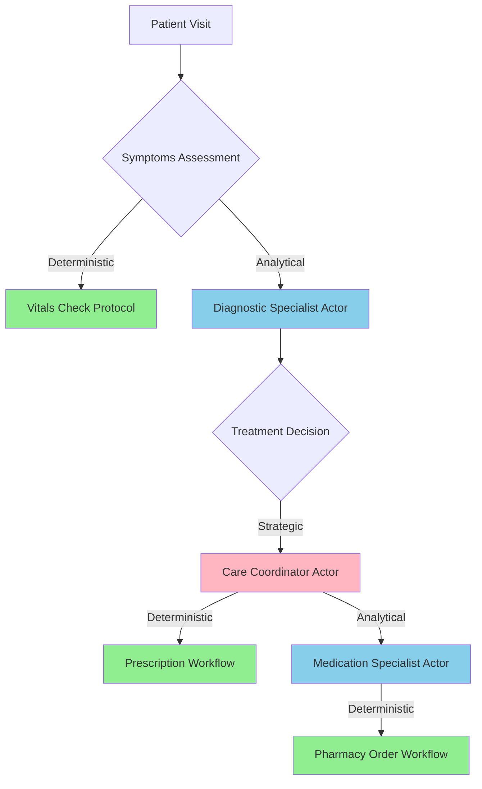
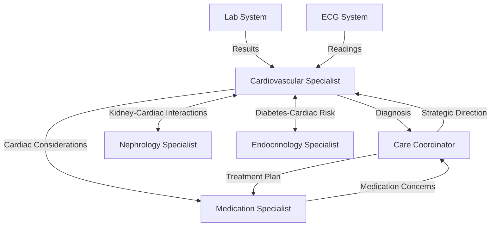
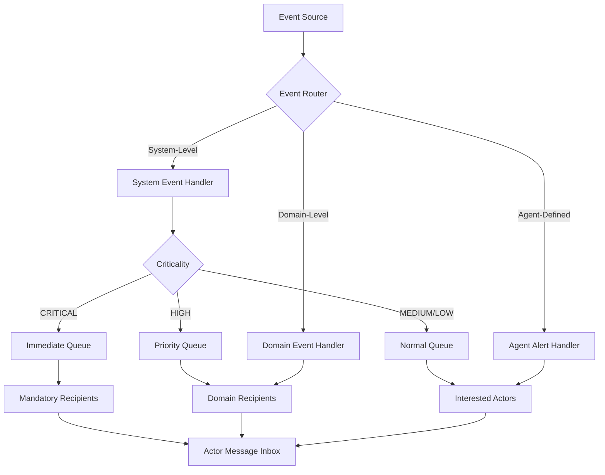
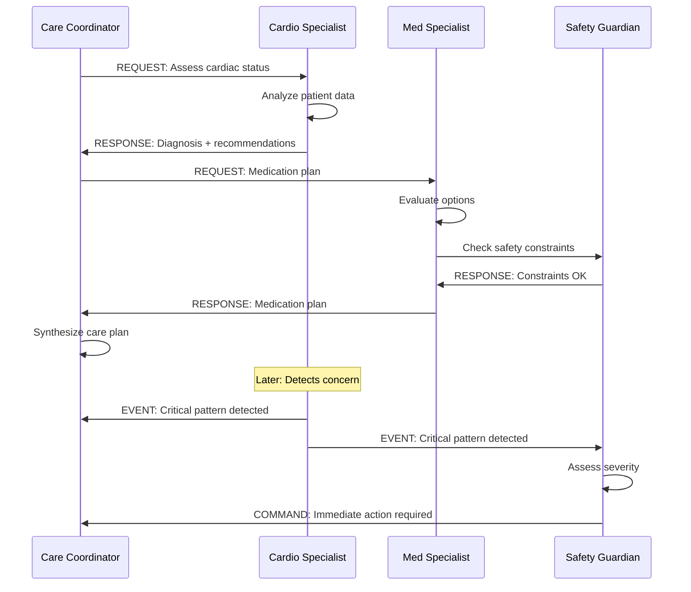

# V. DESIGN PIPELINE

## Overview

The 6-phase design pipeline provides a systematic approach to architecting event-driven actor-based agentic systems. Each phase builds on the previous, with clear deliverables and validation checkpoints.

**Pipeline Structure**:

```
Phase 1: Domain Analysis & Decomposition (2-4 weeks)
   ↓ Deliverables: Domain Map, Process Flows, Expertise Catalog, Event Registry
   
Phase 2: Actor Architecture Design (2-3 weeks)
   ↓ Deliverables: Actor Specs, Communication Matrix, Responsibility Map
   
Phase 3: Event & Communication Design (1-2 weeks)
   ↓ Deliverables: Event Architecture, Message Protocols, Flow Diagrams
   
Phase 4: State/Tool/Model Specification (2-3 weeks)
   ↓ Deliverables: State Schemas, Tool Specs, Model Plans, Context Budgets
   
Phase 5: Implementation & Integration (4-8 weeks)
   ↓ Deliverables: Running System, Test Suite, Observability Infrastructure
   
Phase 6: Learning & Optimization (Ongoing)
   ↓ Deliverables: Training Pipeline, A/B Testing, Continuous Improvement

Total Timeline: 12-20 weeks initial build + ongoing optimization
```

**Critical Success Factors**:
- Don't skip Domain Analysis - it's the foundation
- Validate at each phase before proceeding
- Involve domain experts throughout
- Start simple, evolve complexity
- Measure everything from day one

---

## Phase 1: Domain Analysis & Decomposition (2-4 weeks)

**Goal**: Understand the domain deeply enough to identify natural expertise boundaries and persistent entities.

### Stage 1.1: Domain Mapping

**Objective**: Define the scope and identify what the system needs to understand.

#### Activities

**1. Identify Domain Boundaries**

Create a clear scope document answering:

```yaml
domain_scope:
  what_is_in_scope:
    - "Patient care coordination"
    - "Treatment planning and monitoring"
    - "Multi-specialty collaboration"
    
  what_is_out_of_scope:
    - "Billing and insurance"
    - "Facility management"
    - "Medical device operation"
    
  interfaces_to_external_systems:
    - "EMR system (read patient data)"
    - "Lab system (receive results)"
    - "Pharmacy system (send prescriptions)"
    
  success_criteria:
    - "Improve care coordination efficiency by 30%"
    - "Reduce diagnostic time by 20%"
    - "Increase specialist collaboration quality"
```

**2. Map the Decision Landscape**

Categorize all decisions into three tiers:

```yaml
decision_inventory:
  strategic_decisions:
    description: "High-level, infrequent, long-term impact"
    examples:
      - decision: "Select overall treatment approach"
        frequency: "Once per patient condition"
        impact: "Affects entire care plan"
        requires: "Multi-specialist synthesis"
        
      - decision: "Major care pathway change"
        frequency: "Rare, when current approach failing"
        impact: "Affects multiple treatment areas"
        requires: "Coordinator-level reasoning"
    
  tactical_decisions:
    description: "Medium-level, regular, specific optimization"
    examples:
      - decision: "Adjust medication dosage"
        frequency: "Weekly to monthly"
        impact: "Affects single treatment aspect"
        requires: "Specialist expertise"
        
      - decision: "Order additional diagnostic test"
        frequency: "As needed"
        impact: "Clarifies specific question"
        requires: "Domain knowledge"
    
  operational_decisions:
    description: "Low-level, frequent, immediate execution"
    examples:
      - decision: "Schedule next appointment"
        frequency: "Multiple times daily"
        impact: "Logistical only"
        requires: "Rule-based logic"
        
      - decision: "Send medication reminder"
        frequency: "Daily"
        impact: "Adherence support"
        requires: "Deterministic workflow"
    
  automated_actions:
    description: "No decision needed, pure execution"
    examples:
      - "Record vital signs"
      - "Generate report"
      - "Send notification"
```

**3. Identify Knowledge Domains**

For each decision type, map required expertise:

```yaml
expertise_mapping:
  strategic_decisions:
    "Select treatment approach":
      expertise_needed:
        - "Disease pathophysiology understanding"
        - "Treatment option awareness"
        - "Patient-specific factors consideration"
        - "Evidence-based medicine knowledge"
      
      specialized_knowledge:
        - "Drug interactions and contraindications"
        - "Co-morbidity management"
        - "Patient preference integration"
      
      accumulated_experience_matters:
        - "Pattern: Which approaches work for which patients"
        - "Learning: Treatment response predictions"
        - "Intuition: Risk-benefit assessment"
  
  tactical_decisions:
    "Adjust medication dosage":
      expertise_needed:
        - "Pharmacokinetics knowledge"
        - "Dose-response relationships"
        - "Side effect monitoring"
      
      specialized_knowledge:
        - "Drug-specific dosing algorithms"
        - "Patient factors affecting dosing"
        - "Monitoring parameters"
      
      accumulated_experience_matters:
        - "Pattern: Optimal starting doses by patient profile"
        - "Learning: Individual patient response"
        - "Intuition: When to titrate vs. switch"
```

#### Deliverables

**Domain Map Document**:

```markdown
# Domain Map: Healthcare Care Coordination System

## 1. Scope Definition

**In Scope**: Patient care coordination for chronic disease management
- Multi-specialty care coordination
- Treatment planning and adjustment
- Patient monitoring and follow-up

**Out of Scope**: 
- Medical billing
- Facility management
- Emergency medicine

## 2. Decision Landscape

### Strategic Decisions (Coordinator-level)
| Decision | Frequency | Impact | Complexity |
|----------|-----------|--------|------------|
| Treatment approach selection | Per condition | High | High |
| Care pathway determination | Quarterly | High | High |
| Specialist coordination strategy | Monthly | Medium | Medium |

### Tactical Decisions (Specialist-level)
| Decision | Frequency | Impact | Complexity |
|----------|-----------|--------|------------|
| Medication adjustment | Weekly | Medium | Medium |
| Diagnostic test ordering | As needed | Medium | Low |
| Referral to other specialist | As needed | Medium | Medium |

### Operational Actions (Workflow-level)
| Action | Frequency | Impact | Complexity |
|--------|-----------|--------|------------|
| Appointment scheduling | Daily | Low | Low |
| Reminder sending | Daily | Low | Low |
| Report generation | Daily | Low | Low |

## 3. Knowledge Domains Required

### Clinical Diagnosis (Disease-specific)
- **Cardiovascular**: Heart disease, hypertension, arrhythmias
- **Endocrinology**: Diabetes, thyroid disorders
- **Nephrology**: Kidney disease, electrolyte management

### Pharmacology
- Drug interactions and contraindications
- Dosing algorithms and adjustments
- Side effect management

### Patient Management
- Adherence assessment and improvement
- Patient education and motivation
- Care plan communication

### Care Coordination
- Multi-specialty workflow coordination
- Information synthesis across domains
- Conflict resolution between recommendations

## 4. Success Metrics

- Care coordination efficiency: 30% improvement
- Diagnostic time: 20% reduction
- Specialist collaboration: Quality score > 8.5/10
- Patient satisfaction: Score > 4.5/5
```

#### Validation Checklist

```yaml
phase_1_1_validation:
  domain_boundaries:
    - [ ] Clear scope defined
    - [ ] In-scope items listed and justified
    - [ ] Out-scope items explicitly excluded
    - [ ] External interfaces identified
    
  decision_landscape:
    - [ ] All major decision types catalogued
    - [ ] Decisions categorized by tier
    - [ ] Frequency and impact documented
    - [ ] Complexity assessed
    
  knowledge_domains:
    - [ ] Required expertise identified per decision
    - [ ] Specialized knowledge documented
    - [ ] Learning opportunities recognized
    - [ ] Experience accumulation paths clear
    
  stakeholder_review:
    - [ ] Domain experts consulted
    - [ ] Business stakeholders aligned
    - [ ] Technical feasibility assessed
    - [ ] Success metrics agreed
```

---

### Stage 1.2: Process Flow Analysis

**Objective**: Map current workflows and classify decision points for actor vs. workflow determination.

#### Activities

**1. Map Current Workflows**

Document existing processes with detailed steps:

```yaml
workflow_example:
  name: "New Patient Diagnosis Workflow"
  trigger: "Patient presents with symptoms"
  
  steps:
    - step: 1
      action: "Triage assessment"
      actor: "Triage nurse"
      decision_required: true
      decision_type: "Classify urgency"
      complexity: "Low"
      
    - step: 2
      action: "Initial examination"
      actor: "Primary physician"
      decision_required: true
      decision_type: "Identify primary concern"
      complexity: "Medium"
      
    - step: 3
      action: "Order diagnostic tests"
      actor: "Primary physician"
      decision_required: true
      decision_type: "Which tests needed"
      complexity: "Medium"
      information_needed:
        - "Patient symptoms"
        - "Medical history"
        - "Physical examination findings"
      
    - step: 4
      action: "Await test results"
      actor: "System"
      decision_required: false
      
    - step: 5
      action: "Interpret test results"
      actor: "Specialist (if needed)"
      decision_required: true
      decision_type: "Diagnosis determination"
      complexity: "High"
      expertise_required: "Domain-specific medical knowledge"
      
    - step: 6
      action: "Develop treatment plan"
      actor: "Care coordinator"
      decision_required: true
      decision_type: "Strategic treatment selection"
      complexity: "High"
      requires_coordination: true
      
    - step: 7
      action: "Execute treatment plan"
      actor: "Multiple (nurses, pharmacy, etc.)"
      decision_required: false
      workflow_type: "Deterministic"
```

**2. Identify Decision Points**

For each decision point, classify:

```yaml
decision_point_classification:
  step_5_diagnosis:
    description: "Interpret test results and determine diagnosis"
    
    characteristics:
      requires_judgment: true
      context_dependent: true
      expertise_specific: true
      learns_from_outcomes: true
      
    classification: "ACTOR DECISION"
    rationale: |
      - Requires accumulated diagnostic expertise
      - Pattern recognition from past cases
      - Context-dependent interpretation
      - Improves with experience
    
    proposed_actor: "Diagnostic Specialist Actor"
    actor_type: "Specialist Pattern"
    
  step_7_execute:
    description: "Execute prescribed treatment steps"
    
    characteristics:
      requires_judgment: false
      context_dependent: false
      rule_based: true
      deterministic: true
      
    classification: "WORKFLOW EXECUTION"
    rationale: |
      - Clear procedural steps
      - No judgment required
      - Compliance-critical
      - Fast execution needed
    
    implementation: "Deterministic Workflow"
```

**3. Classify Decision Types**

Use this framework:

```yaml
decision_classification_framework:
  deterministic_rule_based:
    characteristics:
      - "Clear criteria defined upfront"
      - "No judgment or interpretation needed"
      - "Binary or simple categorical output"
      - "Compliance or safety critical"
    
    examples:
      - "Is patient eligible for treatment? (check criteria)"
      - "Schedule next appointment (apply rules)"
      - "Send medication reminder (time-based)"
    
    implementation: "Workflow with state machine"
    
  analytical_expertise_based:
    characteristics:
      - "Requires pattern recognition"
      - "Context interpretation needed"
      - "Trade-off evaluation required"
      - "Experience improves outcomes"
    
    examples:
      - "Diagnose condition from symptoms + tests"
      - "Select optimal treatment approach"
      - "Adjust medication based on response"
    
    implementation: "Specialist Actor with LLM reasoning"
    
  strategic_experience_based:
    characteristics:
      - "Long-term implications significant"
      - "Multiple factors to balance"
      - "Accumulated wisdom matters"
      - "Synthesis of multiple inputs needed"
    
    examples:
      - "Develop overall care strategy"
      - "Coordinate multiple specialists"
      - "Major treatment pathway change"
    
    implementation: "Coordinator Actor with belief maintenance"
```

#### Deliverables

**Process Flow Diagrams with Classification**:



**Decision Classification Matrix**:

```markdown
# Decision Classification Matrix

| Decision Point | Type | Complexity | Actor/Workflow | Rationale |
|----------------|------|------------|----------------|-----------|
| Symptom triage | Deterministic | Low | Workflow | Clear criteria, rule-based |
| Order vitals check | Deterministic | Low | Workflow | Standard protocol |
| Interpret ECG | Analytical | High | Specialist Actor | Pattern recognition, expertise |
| Diagnose condition | Analytical | High | Specialist Actor | Complex reasoning, learning |
| Select treatment | Strategic | High | Coordinator Actor | Multi-factor synthesis |
| Adjust medication | Analytical | Medium | Specialist Actor | Expertise-based optimization |
| Execute order | Deterministic | Low | Workflow | Procedural, compliance |
| Schedule followup | Deterministic | Low | Workflow | Rule-based scheduling |
```

**Workflow-Actor Boundary Documentation**:

```yaml
workflow_actor_boundaries:
  workflows_for:
    - "Deterministic sequences (e.g., order execution)"
    - "Compliance-critical processes (e.g., medication administration)"
    - "Standard protocols (e.g., vital signs collection)"
    - "Notification and alerting (e.g., reminders)"
    
  actors_for:
    - "Diagnostic reasoning (e.g., condition identification)"
    - "Treatment optimization (e.g., medication adjustment)"
    - "Strategic planning (e.g., care coordination)"
    - "Pattern recognition (e.g., trend analysis)"
    
  hybrid_patterns:
    - "Actor coordinates workflow: Actor makes strategic decision, workflow executes"
    - "Workflow triggers actor: Workflow detects condition, actor analyzes"
    - "Actor uses workflow internally: Actor decides, workflow ensures reliability"
```

#### Validation Checklist

```yaml
phase_1_2_validation:
  workflow_mapping:
    - [ ] All major workflows documented
    - [ ] Steps clearly defined with actors
    - [ ] Decision points identified
    - [ ] Information flows mapped
    - [ ] Outputs specified
    
  decision_classification:
    - [ ] Each decision point classified
    - [ ] Classification rationale documented
    - [ ] Deterministic vs. analytical vs. strategic clear
    - [ ] Actor vs. workflow assignment justified
    
  boundary_definition:
    - [ ] Clear rules for workflow use cases
    - [ ] Clear rules for actor use cases
    - [ ] Hybrid patterns identified
    - [ ] Edge cases addressed
```

---

### Stage 1.3: Expertise Identification

**Objective**: Identify natural specializations that will become actors.

#### Activities

**1. Identify Natural Specializations**

Look for bounded domains with these characteristics:

```yaml
specialization_identification:
  criteria:
    bounded_domain:
      question: "Does this have clear, well-defined scope?"
      examples:
        - ✓ "Cardiovascular diagnosis" (bounded)
        - ✗ "All medical diagnosis" (too broad)
        - ✓ "Brazilian contract law" (bounded)
        - ✗ "All law" (too broad)
    
    accumulated_expertise:
      question: "Does experience significantly improve outcomes?"
      indicators:
        - "Success rate increases over time"
        - "Faster/better decisions with practice"
        - "Pattern recognition develops"
        - "Intuition builds"
    
    clear_success_metrics:
      question: "Can we measure performance objectively?"
      examples:
        - "Diagnostic accuracy"
        - "Treatment success rate"
        - "Research quality score"
        - "Risk prediction accuracy"
    
    meaningful_learning:
      question: "Are there outcomes to learn from?"
      requirements:
        - "Clear success/failure signals"
        - "Attributable to decisions"
        - "Patterns to discover"
        - "Strategies to optimize"
```

**Example Application - Healthcare**:

```yaml
healthcare_specializations:
  cardiovascular_specialist:
    bounded_domain: "Heart disease diagnosis and monitoring"
    scope:
      includes: ["ECG interpretation", "Cardiac risk assessment", "Heart failure management"]
      excludes: ["Non-cardiac chest pain", "Pulmonary issues", "GI causes"]
    
    accumulated_expertise_evidence:
      - "Cardiologists develop pattern recognition for ECG abnormalities"
      - "Experience improves diagnostic accuracy significantly"
      - "Intuition about cardiac risk develops over years"
    
    success_metrics:
      - "Diagnostic accuracy (sensitivity/specificity)"
      - "Time to diagnosis"
      - "False positive/negative rates"
      - "Patient outcomes (mortality, readmissions)"
    
    learning_opportunities:
      - "Learn which symptom combinations indicate MI vs. angina"
      - "Learn patient-specific risk factors"
      - "Learn optimal diagnostic strategies"
    
    validation: "VALID SPECIALIZATION → Actor"
  
  medication_management_specialist:
    bounded_domain: "Drug therapy optimization"
    scope:
      includes: ["Dosing", "Drug interactions", "Side effect management"]
      excludes: ["Diagnosis", "Non-pharmacologic treatments"]
    
    accumulated_expertise_evidence:
      - "Pharmacists develop deep drug knowledge"
      - "Experience with patient responses improves dosing"
      - "Pattern recognition for side effects"
    
    success_metrics:
      - "Treatment adherence rates"
      - "Therapeutic goal achievement"
      - "Adverse event prevention"
      - "Drug interaction avoidance"
    
    learning_opportunities:
      - "Learn optimal starting doses by patient profile"
      - "Learn individual patient drug responses"
      - "Learn effective patient education strategies"
    
    validation: "VALID SPECIALIZATION → Actor"
  
  appointment_scheduler:
    bounded_domain: "Appointment scheduling"
    scope: ["Find available slots", "Book appointments", "Send reminders"]
    
    accumulated_expertise_evidence:
      - "Rule-based, no expertise accumulation"
      - "Same logic applies every time"
      - "No learning opportunity"
    
    validation: "NOT A SPECIALIZATION → Workflow"
```

**2. Validate Specialization Boundaries**

Apply this validation framework:

```yaml
specialization_validation:
  for_each_candidate:
    questions:
      lifecycle:
        question: "Does this have meaningful lifecycle?"
        tests:
          - "Can track performance over time?"
          - "Does state accumulate across interactions?"
          - "Is there continuity between decisions?"
        
        validation_rule: "Must answer YES to all"
      
      expertise_development:
        question: "Does experience improve outcomes?"
        tests:
          - "Can measure improvement over time?"
          - "Are there patterns to learn?"
          - "Does intuition develop?"
        
        validation_rule: "Must show measurable improvement"
      
      state_accumulation:
        question: "Is there meaningful state?"
        tests:
          - "Does history matter for decisions?"
          - "Is context carried forward?"
          - "Are there working theories/beliefs?"
        
        validation_rule: "State must be > simple status"
      
      learning_environment:
        question: "Can this learn and improve?"
        tests:
          - "Are there clear outcomes?"
          - "Can attribute outcomes to actions?"
          - "Is there reward signal?"
        
        validation_rule: "Must be learnable"
      
      irreplaceability:
        question: "Would losing this be costly?"
        tests:
          - "Is accumulated knowledge unique?"
          - "Would you need to relearn?"
          - "Is expertise valuable?"
        
        validation_rule: "Expertise must have value"
```

**3. Identify Dependencies**

Map how specializations interact:

```yaml
specialization_dependencies:
  cardiovascular_specialist:
    requires_input_from:
      - name: "Lab System"
        type: "External"
        data: "Troponin, BNP, lipid panel results"
        
      - name: "ECG System"
        type: "External"
        data: "ECG readings and interpretations"
    
    provides_output_to:
      - name: "Care Coordinator"
        type: "Actor"
        data: "Cardiac diagnoses and recommendations"
        
      - name: "Medication Specialist"
        type: "Actor"
        data: "Cardiac medication considerations"
    
    collaborates_with:
      - name: "Nephrology Specialist"
        reason: "Kidney function affects cardiac medications"
        
      - name: "Endocrinology Specialist"
        reason: "Diabetes impacts cardiac risk"
    
    conflicts_with:
      - name: "Medication Specialist"
        conflict: "Drug recommendations may conflict"
        resolution: "Escalate to Care Coordinator"
```

#### Deliverables

**Expertise Domain Catalog**:

```yaml
expertise_catalog:
  version: "1.0"
  last_updated: "2025-11-04"
  
  domains:
    - id: "cardio_dx_specialist"
      name: "Cardiovascular Diagnosis Specialist"
      
      scope:
        description: "Heart disease diagnosis and monitoring"
        includes:
          - "ECG interpretation"
          - "Cardiac biomarker analysis"
          - "Heart failure assessment"
          - "Arrhythmia detection"
        excludes:
          - "Non-cardiac chest pain"
          - "Pulmonary disease"
          - "General medicine"
      
      lifecycle:
        creation: "When patient shows cardiac symptoms"
        duration: "Throughout patient's cardiac care"
        termination: "When cardiac condition resolved or patient discharged"
      
      learning_profile:
        learns_from:
          - "Diagnostic outcomes (confirmed diagnoses)"
          - "Treatment responses"
          - "Test result patterns"
        
        improves_in:
          - "Diagnostic accuracy"
          - "Time to diagnosis"
          - "Risk stratification"
          - "Test selection efficiency"
        
        success_metrics:
          - metric: "Diagnostic accuracy"
            target: ">90%"
            measurement: "Confirmed diagnoses / total diagnoses"
          
          - metric: "Early detection rate"
            target: "Improve 20%"
            measurement: "Time from presentation to diagnosis"
      
      dependencies:
        requires:
          - "Lab results (external)"
          - "ECG data (external)"
          - "Patient history (Care Coordinator)"
        
        provides_to:
          - "Care Coordinator (diagnosis, recommendations)"
          - "Medication Specialist (cardiac considerations)"
        
        collaborates_with:
          - actor: "Nephrology Specialist"
            reason: "Kidney-cardiac interactions"
          - actor: "Endocrinology Specialist"
            reason: "Diabetes-cardiac risk"
      
      estimated_context_size: "12-15K tokens"
      
      validation_status: "APPROVED"
      validation_date: "2025-11-01"
      validated_by: ["Chief Medical Informatics Officer", "Cardiology Lead"]
```

**Dependency Map**:



#### Validation Checklist

```yaml
phase_1_3_validation:
  specialization_identification:
    - [ ] All potential specializations listed
    - [ ] Each has bounded domain
    - [ ] Scope clearly defined (includes/excludes)
    - [ ] Natural boundaries validated
    
  expertise_validation:
    - [ ] Has meaningful lifecycle
    - [ ] Experience improves outcomes (evidence)
    - [ ] State accumulates meaningfully
    - [ ] Can learn from outcomes
    - [ ] Expertise is irreplaceable
    - [ ] Context window reasonable (<25K tokens)
    
  dependency_mapping:
    - [ ] Input requirements identified
    - [ ] Output destinations specified
    - [ ] Collaboration needs documented
    - [ ] Conflicts identified with resolution
    - [ ] No circular dependencies
    
  stakeholder_validation:
    - [ ] Domain experts reviewed
    - [ ] Boundaries make sense to practitioners
    - [ ] Success metrics agreed upon
    - [ ] No gaps in coverage identified
```

---

### Stage 1.4: Event & Trigger Identification

**Objective**: Identify both system-level (mandatory) and domain-level (agent-defined) events that drive actor behavior.

#### Activities

**1. Identify System-Level Events**

These are **critical infrastructure events** that must always be handled:

```yaml
system_level_events:
  category: "Compliance & Regulatory"
  characteristics:
    - "Cannot be disabled by agents"
    - "Legally or ethically required"
    - "Failure has serious consequences"
  
  examples:
    - event_id: "REGULATORY_DEADLINE_APPROACHING"
      description: "Legal or regulatory deadline within threshold"
      trigger_condition: "deadline_date - current_date <= 7 days"
      criticality: "CRITICAL"
      mandatory_recipients:
        - "Responsible Actor"
        - "Compliance Monitor"
        - "Legal Team Notification"
      sla: "4 hours for notification"
      cannot_be_disabled: true
      consequences_of_missing: "Regulatory penalties, legal liability"
      
    - event_id: "PATIENT_VITALS_CRITICAL"
      description: "Patient vital signs outside critical safety range"
      trigger_condition: |
        systolic_bp > 180 OR systolic_bp < 90 OR
        heart_rate > 130 OR heart_rate < 40 OR
        temperature > 39.5 OR temperature < 35
      criticality: "CRITICAL"
      mandatory_recipients:
        - "Care Coordinator"
        - "On-Call Physician"
        - "Emergency Response Team"
      sla: "Immediate"
      cannot_be_disabled: true
      consequences_of_missing: "Patient harm, death"
      
    - event_id: "ADVERSE_DRUG_EVENT_DETECTED"
      description: "Drug interaction or adverse reaction detected"
      trigger_condition: "interaction_severity == 'contraindicated' OR reaction_severity > 'moderate'"
      criticality: "CRITICAL"
      mandatory_recipients:
        - "Prescribing Physician"
        - "Pharmacist"
        - "Patient Safety Monitor"
      sla: "Immediate"
      cannot_be_disabled: true
      consequences_of_missing: "Patient harm"

  category: "Risk & Safety"
  characteristics:
    - "Protect against harm"
    - "Prevent cascading failures"
    - "System integrity maintenance"
  
  examples:
    - event_id: "CRITICAL_THRESHOLD_BREACH"
      description: "System metric exceeded critical threshold"
      trigger_condition: "metric_value > critical_threshold"
      criticality: "HIGH"
      mandatory_recipients:
        - "Guardian Actor"
        - "System Monitor"
        - "Operations Team"
      sla: "15 minutes"
      
    - event_id: "ACTOR_FAILURE_RATE_HIGH"
      description: "Actor error rate exceeds acceptable level"
      trigger_condition: "error_rate > 0.10 in last hour"
      criticality: "HIGH"
      mandatory_recipients:
        - "Supervisor Actor"
        - "Monitoring System"
      sla: "5 minutes"

  category: "Process Milestones"
  characteristics:
    - "Required process checkpoints"
    - "Workflow stage completions"
    - "Handoff requirements"
  
  examples:
    - event_id: "STAGE_COMPLETION_REQUIRED"
      description: "Process stage must complete before proceeding"
      trigger_condition: "stage_status == 'ready_for_review' AND approval_required"
      criticality: "HIGH"
      mandatory_recipients:
        - "Process Owner"
        - "Approver"
      sla: "24 hours"
      
    - event_id: "HANDOFF_CHECKPOINT"
      description: "Work must be transferred to next actor"
      trigger_condition: "current_stage_complete AND next_actor_identified"
      criticality: "MEDIUM"
      mandatory_recipients:
        - "Current Actor"
        - "Next Actor"
        - "Process Coordinator"
      sla: "2 hours"

  category: "External Events"
  characteristics:
    - "Initiated by external systems/parties"
    - "Not controllable by system"
    - "Must respond appropriately"
  
  examples:
    - event_id: "EXTERNAL_DEADLINE_IMPOSED"
      description: "External party sets deadline"
      trigger_condition: "external_party_message.type == 'deadline'"
      criticality: "HIGH"
      mandatory_recipients:
        - "Responsible Actor"
        - "Deadline Monitor"
      sla: "1 hour"
      
    - event_id: "STAKEHOLDER_REQUEST"
      description: "Important stakeholder requires action"
      trigger_condition: "stakeholder_priority == 'high' AND request_type == 'urgent'"
      criticality: "HIGH"
      mandatory_recipients:
        - "Primary Handler"
        - "Stakeholder Relations"
      sla: "4 hours"
```

**2. Identify Domain Events**

These are events within specific expertise domains that actors monitor:

```yaml
domain_events:
  domain: "Cardiovascular Specialist"
  
  events:
    - event_id: "CARDIAC_PATTERN_DETECTED"
      description: "ECG or biomarker pattern suggests cardiac event"
      trigger_condition: "pattern_match_confidence > 0.80"
      criticality: "HIGH"
      domain_specific: true
      agent_can_modify: false  # Pattern detection itself is fixed
      
      recipients:
        - "Cardiovascular Specialist (self)"
        - "Care Coordinator"
      
      action_required: "Assess significance, determine intervention"
      
    - event_id: "TREATMENT_RESPONSE_MILESTONE"
      description: "Patient reached treatment milestone (e.g., 30 days on medication)"
      trigger_condition: "days_on_treatment % 30 == 0"
      criticality: "MEDIUM"
      domain_specific: true
      
      recipients:
        - "Cardiovascular Specialist"
        - "Medication Specialist"
      
      action_required: "Evaluate treatment effectiveness, consider adjustment"
    
  domain: "Care Coordinator"
  
  events:
    - event_id: "CONFLICTING_RECOMMENDATIONS"
      description: "Multiple specialists provide conflicting recommendations"
      trigger_condition: "detect_conflict(specialist_recommendations)"
      criticality: "HIGH"
      domain_specific: true
      
      recipients:
        - "Care Coordinator (self)"
        - "Conflicting Specialists"
      
      action_required: "Mediate conflict, synthesize optimal approach"
```

**3. Classify Event Criticality**

Use consistent criticality levels:

```yaml
criticality_classification:
  CRITICAL:
    definition: "Immediate response required, serious consequences if missed"
    response_time: "Immediate (< 1 minute)"
    examples:
      - "Patient safety emergency"
      - "System failure"
      - "Critical deadline imminent"
    handling:
      - "Interrupt current processing"
      - "Highest priority queue"
      - "Multiple notification channels"
      - "Escalation if not acknowledged"
    
  HIGH:
    definition: "Response within defined SLA, significant impact"
    response_time: "< 15 minutes"
    examples:
      - "Important deadline approaching"
      - "Quality threshold breach"
      - "Specialist coordination needed"
    handling:
      - "High priority queue"
      - "Normal notification channels"
      - "SLA tracking"
    
  MEDIUM:
    definition: "Response when convenient, moderate impact"
    response_time: "< 4 hours"
    examples:
      - "Routine milestone"
      - "Scheduled review"
      - "Non-urgent coordination"
    handling:
      - "Normal priority queue"
      - "Batching acceptable"
    
  LOW:
    definition: "Batch processing acceptable, minimal impact"
    response_time: "< 24 hours"
    examples:
      - "Informational updates"
      - "Routine logging"
      - "Background processing"
    handling:
      - "Batch processing"
      - "Low priority queue"
```

**4. Design Agent-Defined Event API**

Actors should be able to dynamically set monitoring conditions:

```typescript
// API for actors to define custom triggers
type AgentDefinedEvent = {
  alert_id: string
  actor_id: string
  condition: EventCondition
  actions: Action[]
  priority: Priority
  ttl: Option.Option<Duration>
  reasoning: string
}

type EventCondition = 
  | { _tag: "Threshold"; metric: string; operator: Operator; value: number }
  | { _tag: "Pattern"; pattern: string; confidence: number }
  | { _tag: "Composite"; conditions: EventCondition[]; logic: "AND" | "OR" }
  | { _tag: "TimeBased"; schedule: Schedule }

// Actor sets custom alert
class ActorEntity {
  setCustomAlert(alert: AgentDefinedEvent) {
    return Effect.gen(function* () {
      const eventSystem = yield* EventSystem
      
      // Validate alert doesn't conflict with system events
      yield* eventSystem.validateAgentAlert(alert)
      
      // Register alert
      yield* eventSystem.registerAgentAlert(alert)
      
      // Store in actor state for reference
      const stateRef = yield* Entity.state()
      yield* Ref.update(stateRef, state => ({
        ...state,
        active_alerts: [...state.active_alerts, alert]
      }))
    })
  }
}

// Example: Care coordinator sets strategic alert
coordinator.setCustomAlert({
  alert_id: "patient_123_glucose_improvement",
  actor_id: "coordinator_456",
  condition: {
    _tag: "Threshold",
    metric: "patient.glucose_average",
    operator: "<",
    value: 140
  },
  actions: [
    { _tag: "NotifyActor", actor: "medication_specialist" },
    { _tag: "ConsiderAdjustment", type: "medication_reduction" }
  ],
  priority: "MEDIUM",
  ttl: Option.some(Duration.days(90)),
  reasoning: "If glucose improves, consider reducing medication dosage"
})
```

#### Deliverables

**Event Catalog**:

```yaml
event_catalog:
  version: "1.0"
  system_name: "Healthcare Care Coordination"
  
  system_level_events:
    - event_id: "CRITICAL_VITALS"
      name: "Patient Vitals Critical"
      category: "Safety"
      trigger: "Vital signs outside critical range"
      criticality: "CRITICAL"
      sla: "Immediate"
      mandatory_recipients: ["Care Coordinator", "Emergency Response"]
      cannot_disable: true
      
    - event_id: "REGULATORY_DEADLINE"
      name: "Regulatory Deadline Approaching"
      category: "Compliance"
      trigger: "Deadline within 7 days"
      criticality: "CRITICAL"
      sla: "4 hours"
      mandatory_recipients: ["Responsible Actor", "Compliance Monitor"]
      cannot_disable: true
      
    - event_id: "ADVERSE_DRUG_EVENT"
      name: "Adverse Drug Event Detected"
      category: "Safety"
      trigger: "Drug interaction or adverse reaction"
      criticality: "CRITICAL"
      sla: "Immediate"
      mandatory_recipients: ["Prescribing Physician", "Pharmacist", "Safety Monitor"]
      cannot_disable: true
  
  domain_level_events:
    - event_id: "CARDIAC_PATTERN"
      name: "Cardiac Pattern Detected"
      domain: "Cardiovascular"
      trigger: "Pattern confidence > 0.80"
      criticality: "HIGH"
      recipients: ["Cardiovascular Specialist", "Care Coordinator"]
      agent_modifiable: false
      
    - event_id: "TREATMENT_MILESTONE"
      name: "Treatment Milestone Reached"
      domain: "Medication Management"
      trigger: "30/60/90 day treatment milestones"
      criticality: "MEDIUM"
      recipients: ["Medication Specialist", "Care Coordinator"]
      agent_modifiable: true
  
  agent_defined_event_schema:
    description: "API for actors to define custom monitoring"
    fields:
      - alert_id: "Unique identifier"
      - actor_id: "Actor setting alert"
      - condition: "Trigger condition (threshold/pattern/composite)"
      - actions: "Actions to take when triggered"
      - priority: "Alert priority level"
      - ttl: "How long to monitor (optional)"
      - reasoning: "Why this alert matters"
```

**Event Flow Diagram**:



#### Validation Checklist

```yaml
phase_1_4_validation:
  system_events:
    - [ ] All critical events identified
    - [ ] Mandatory recipients specified
    - [ ] SLAs defined
    - [ ] Cannot-disable flag set appropriately
    - [ ] Consequences of missing documented
    
  domain_events:
    - [ ] Events identified per domain
    - [ ] Criticality assessed
    - [ ] Recipients specified
    - [ ] Action requirements clear
    
  event_classification:
    - [ ] All events have criticality level
    - [ ] Criticality criteria documented
    - [ ] Response times defined
    - [ ] Handling procedures specified
    
  agent_event_api:
    - [ ] API designed for agent-defined events
    - [ ] Validation rules defined
    - [ ] Conflict prevention mechanisms
    - [ ] TTL and lifecycle management
    
  coverage:
    - [ ] No critical scenarios without events
    - [ ] All regulatory requirements covered
    - [ ] Safety concerns addressed
    - [ ] Process milestones covered
```

---

### Phase 1 Summary

**Total Duration**: 2-4 weeks

**Key Deliverables Package**:
1. Domain Map Document
2. Process Flow Diagrams with Classifications
3. Decision Classification Matrix
4. Expertise Domain Catalog
5. Dependency Maps
6. Event Catalog
7. Validation Reports

**Phase 1 Complete Validation**:

```yaml
phase_1_complete_validation:
  domain_understanding:
    - [ ] Domain boundaries crystal clear
    - [ ] All major decisions catalogued
    - [ ] Decision classification complete
    - [ ] Workflow vs. actor boundaries defined
    
  expertise_identification:
    - [ ] Natural specializations found
    - [ ] Each validated against criteria
    - [ ] Dependencies mapped
    - [ ] No gaps in coverage
    - [ ] Context windows reasonable
    
  event_architecture:
    - [ ] System-level events complete
    - [ ] Domain events identified
    - [ ] Event criticality classified
    - [ ] Agent event API designed
    
  stakeholder_alignment:
    - [ ] Domain experts consulted throughout
    - [ ] Business stakeholders agree on scope
    - [ ] Technical feasibility confirmed
    - [ ] Success metrics agreed upon
    
  documentation:
    - [ ] All deliverables complete
    - [ ] Clear and understandable
    - [ ] Reviewed and approved
    - [ ] Ready for Phase 2

  ready_for_phase_2:
    condition: "All checkboxes above must be checked"
    sign_off_required:
      - "Domain Expert Lead"
      - "Technical Architect"
      - "Product Owner"
```

**Transition to Phase 2**:

With Phase 1 complete, you now have:
- Clear understanding of what the system must do
- Identification of where expertise matters
- Classification of decisions → actors vs. workflows
- Catalog of specialized domains → candidate actors
- Event architecture foundation

Phase 2 will take these expertise domains and design the actual actor architecture, defining responsibilities, communication patterns, and coordination mechanisms.

---

## Phase 2: Actor Architecture Design (2-3 weeks)

**Goal**: Design the actor hierarchy, define clear responsibilities, and specify communication patterns.

### Stage 2.1: Actor Identification

**Objective**: Transform expertise domains from Phase 1 into concrete actor specifications.

#### Activities

**1. Map Expertise Domains to Actors**

For each expertise domain from Phase 1, create actor specification:

```yaml
actor_specification_template:
  actor_id: "unique_identifier"
  actor_name: "Human-readable name"
  
  classification:
    pattern: "Specialist | Coordinator | Guardian | Executor | Integrator"
    rationale: "Why this pattern fits"
  
  expertise_domain:
    primary: "Core area of expertise"
    secondary: ["Supporting areas"]
    boundaries:
      includes: ["What this actor knows"]
      excludes: ["What it doesn't handle"]
  
  responsibilities:
    primary: ["Main accountabilities"]
    secondary: ["Supporting duties"]
  
  lifecycle:
    created_when: "Trigger for actor creation"
    persists: "Duration of existence"
    terminated_when: "End condition"
  
  success_metrics:
    - metric: "Specific measurable outcome"
      target: "Quantitative goal"
      measurement: "How to measure"
  
  learning_profile:
    learns_from: ["What outcomes teach this actor"]
    improves_in: ["What gets better over time"]
    training_environment: "RL environment definition"
  
  estimated_context_size: "Token count estimate"
  
  validation:
    maps_to_persistent_expertise: boolean
    has_meaningful_lifecycle: boolean
    can_learn_and_improve: boolean
    irreplaceable_expertise: boolean
    context_within_budget: boolean
```

**Example: Healthcare Cardiovascular Specialist**

```yaml
actor_specification:
  actor_id: "cardio_dx_specialist"
  actor_name: "Cardiovascular Diagnosis Specialist"
  
  classification:
    pattern: "Specialist"
    rationale: |
      Deep expertise in narrow domain (cardiovascular disease).
      Watches one domain intensely, learns specific patterns,
      develops specialized intuition over time.
  
  expertise_domain:
    primary: "Cardiovascular disease diagnosis and monitoring"
    secondary: ["Cardiac risk assessment", "Treatment response evaluation"]
    boundaries:
      includes:
        - "ECG interpretation"
        - "Cardiac biomarker analysis (troponin, BNP)"
        - "Heart failure assessment"
        - "Arrhythmia detection"
        - "Cardiac risk stratification"
      excludes:
        - "Non-cardiac chest pain diagnosis"
        - "Pulmonary disease"
        - "Treatment execution (only recommends)"
        - "Medication management (collaborates with specialist)"
  
  responsibilities:
    primary:
      - "Diagnose cardiovascular conditions from symptoms and tests"
      - "Monitor disease progression and treatment response"
      - "Recommend diagnostic procedures (ECG, echo, cath)"
      - "Identify cardiac risk factors and complications"
      - "Assess treatment effectiveness"
    
    secondary:
      - "Educate care coordinator on cardiac implications"
      - "Collaborate with other specialists on co-morbidities"
      - "Flag concerning patterns for urgent review"
  
  lifecycle:
    created_when: "Patient presents with cardiovascular symptoms or risk factors"
    persists: "Throughout patient's cardiovascular care journey"
    terminated_when: "Cardiovascular condition resolved OR patient discharged/transferred"
  
  success_metrics:
    - metric: "Diagnostic accuracy"
      target: ">90% sensitivity and specificity"
      measurement: "Confirmed diagnoses / total diagnoses made"
      
    - metric: "Early detection rate"
      target: "20% improvement over baseline"
      measurement: "Days from presentation to diagnosis"
      
    - metric: "False positive rate"
      target: "<5%"
      measurement: "Incorrect critical diagnoses / total critical diagnoses"
      
    - metric: "Risk prediction accuracy"
      target: "C-statistic >0.80"
      measurement: "ROC curve analysis of risk predictions"
  
  learning_profile:
    learns_from:
      - "Diagnostic outcomes (confirmed diagnoses from gold standards)"
      - "Treatment responses (how patients respond to interventions)"
      - "Test result patterns (correlations between findings and outcomes)"
      - "Complication occurrences (what signs preceded adverse events)"
    
    improves_in:
      - "ECG pattern recognition accuracy"
      - "Cardiac risk stratification precision"
      - "Test selection efficiency (fewer unnecessary tests)"
      - "Complication prediction (earlier warnings)"
    
    training_environment:
      state_space: "Patient demographics, symptoms, vitals, test results, history"
      action_space: "Diagnosis hypotheses, test orders, risk assessments, recommendations"
      reward_signal: "Diagnostic accuracy, timeliness, resource efficiency, patient outcomes"
      episode_definition: "From presentation to confirmed diagnosis + 30 days follow-up"
  
  estimated_context_size: "12-15K tokens"
  
  validation:
    maps_to_persistent_expertise: true  # Cardiology is established specialty
    has_meaningful_lifecycle: true      # Duration of cardiac care
    can_learn_and_improve: true         # Clear learning opportunities
    irreplaceable_expertise: true       # Deep domain knowledge valuable
    context_within_budget: true         # 12-15K < 25K limit
```

**2. Validate Actor Design**

Apply validation framework to each proposed actor:

```yaml
actor_validation_framework:
  criterion_1_persistent_expertise:
    question: "Does this map to persistent domain of expertise?"
    tests:
      - "Is this a noun (entity) not verb (function)?"
      - "Would a human specialize in this full-time?"
      - "Does expertise accumulate over time?"
    
    pass_criteria: "All tests true"
    
    anti_pattern_check:
      - "NOT a decision-point function"
      - "NOT a simple router"
      - "NOT stateless logic"
  
  criterion_2_meaningful_lifecycle:
    question: "Does this have meaningful lifecycle?"
    tests:
      - "Clear creation trigger?"
      - "Persistence across multiple interactions?"
      - "Defined termination condition?"
      - "State accumulates during lifecycle?"
    
    pass_criteria: "All tests true"
    
  criterion_3_learning_opportunity:
    question: "Can this learn and improve?"
    tests:
      - "Clear outcomes to learn from?"
      - "Decisions attributable to this actor?"
      - "Patterns to discover?"
      - "Performance measurably improves?"
    
    pass_criteria: "All tests true"
    
  criterion_4_context_efficiency:
    question: "Is context window reasonable?"
    tests:
      - "Estimated tokens < 25K?"
      - "State can be summarized efficiently?"
      - "Not trying to do too much?"
    
    pass_criteria: "All tests true"
    
    remediation_if_fail:
      - "Split into multiple specialized actors"
      - "Move data to tools"
      - "Increase summarization"
  
  criterion_5_clear_boundaries:
    question: "Are responsibilities well-defined?"
    tests:
      - "Clear includes/excludes?"
      - "No overlap with other actors?"
      - "No orphaned responsibilities?"
    
    pass_criteria: "All tests true"
```

**3. Identify Missing Actors**

Look for gaps in the system:

```yaml
gap_analysis:
  coverage_check:
    question: "Are all expertise domains from Phase 1 covered?"
    method: "Map each domain → actor"
    
    gaps_found:
      - gap: "No actor for cross-specialty synthesis"
        solution: "Add Care Coordinator Actor (Coordinator pattern)"
        
      - gap: "No actor monitoring safety constraints"
        solution: "Add Patient Safety Guardian (Guardian pattern)"
  
  coordination_check:
    question: "Who coordinates between specialists?"
    method: "Examine specialist interactions"
    
    finding: "Specialists need orchestration"
    solution: "Coordinator Actor with strategic oversight"
  
  enforcement_check:
    question: "Who enforces constraints and monitors risk?"
    method: "Review safety and compliance requirements"
    
    finding: "Need safety monitoring and limit enforcement"
    solution: "Guardian Actor for safety rules"
  
  integration_check:
    question: "Who handles cross-domain concerns?"
    method: "Look for information spanning multiple domains"
    
    finding: "Treatment impacts span multiple specialties"
    solution: "Integrator Actor for multi-domain synthesis"
```

#### Deliverables

**Actor Specification Sheets** (one per actor):

```markdown
# Actor Specification: Cardiovascular Diagnosis Specialist

## Classification
- **Pattern**: Specialist
- **Category**: Medical Diagnosis

## Expertise Domain
**Primary**: Cardiovascular disease diagnosis and monitoring

**Scope**:
- Includes: ECG interpretation, cardiac biomarkers, heart failure assessment
- Excludes: Non-cardiac diagnoses, treatment execution, medication management

## Responsibilities
**Primary**:
1. Diagnose cardiovascular conditions from symptoms and tests
2. Monitor disease progression and treatment response
3. Recommend diagnostic procedures
4. Identify cardiac risk factors and complications

**Accountability**: Diagnostic accuracy and timely cardiac assessment

## Lifecycle
- **Created**: Patient presents with cardiovascular symptoms
- **Duration**: Throughout cardiovascular care journey  
- **Terminated**: Condition resolved or patient discharged

## Success Metrics
| Metric | Target | Measurement |
|--------|--------|-------------|
| Diagnostic accuracy | >90% | Confirmed diagnoses / total |
| Early detection | 20% improvement | Days to diagnosis |
| False positive rate | <5% | Incorrect criticals / total |

## Learning Profile
**Learns From**:
- Diagnostic outcomes
- Treatment responses
- Test result patterns
- Complication occurrences

**Improves In**:
- ECG pattern recognition
- Risk stratification
- Test selection efficiency
- Complication prediction

**RL Environment**:
- State: Demographics, symptoms, vitals, tests, history
- Actions: Diagnoses, test orders, risk assessments
- Reward: Accuracy, timeliness, efficiency, outcomes

## Dependencies
**Requires**:
- Lab results (external system)
- ECG data (external system)
- Patient history (Care Coordinator)

**Provides To**:
- Care Coordinator (diagnoses, recommendations)
- Medication Specialist (cardiac considerations)

**Collaborates With**:
- Nephrology Specialist (kidney-cardiac interactions)
- Endocrinology Specialist (diabetes-cardiac risk)

## Context Budget
**Estimated**: 12-15K tokens
**Breakdown**:
- Current patient state: 3K
- Recent observations: 2K
- Active monitoring: 2K
- Current assessment: 3K
- Reasoning space: 5K

## Validation
- ✓ Maps to persistent expertise (Cardiology)
- ✓ Meaningful lifecycle (duration of care)
- ✓ Can learn and improve (clear outcomes)
- ✓ Irreplaceable expertise (specialist knowledge)
- ✓ Context within budget (15K < 25K)

**Status**: APPROVED
**Validated By**: Chief Medical Informatics Officer, Cardiology Lead
**Date**: 2025-11-01
```

**Actor Catalog Summary**:

```yaml
actor_system_catalog:
  system_name: "Healthcare Care Coordination"
  version: "1.0"
  total_actors: 8
  
  actors_by_pattern:
    specialists: 4
      - "Cardiovascular Diagnosis Specialist"
      - "Endocrinology Specialist"
      - "Nephrology Specialist"
      - "Medication Management Specialist"
    
    coordinators: 1
      - "Patient Care Coordinator"
    
    guardians: 1
      - "Patient Safety Guardian"
    
    executors: 1
      - "Treatment Execution Coordinator"
    
    integrators: 1
      - "Multi-Specialty Integrator"
  
  total_estimated_context: "120-150K tokens system-wide"
  context_budget_status: "Within 200K budget with margin"
```

#### Validation Checklist

```yaml
stage_2_1_validation:
  actor_specifications:
    - [ ] All expertise domains mapped to actors
    - [ ] Each actor has complete specification
    - [ ] Pattern classification justified
    - [ ] Responsibilities clearly defined
    - [ ] Lifecycle well-defined
    
  actor_validation:
    - [ ] Each actor validated against criteria
    - [ ] No decision-point functions
    - [ ] No stateless routers
    - [ ] All have learning opportunities
    - [ ] Context budgets reasonable
    
  coverage_analysis:
    - [ ] All domains from Phase 1 covered
    - [ ] No gaps identified
    - [ ] Coordination actors included
    - [ ] Safety/compliance actors included
    
  system_level:
    - [ ] Total context budget acceptable
    - [ ] Actor count manageable
    - [ ] Patterns well-distributed
    - [ ] No redundancy
```

---

### Stage 2.2: Actor Hierarchy & Communication Design

**Objective**: Define how actors relate to each other and communicate.

#### Activities

**1. Define Actor Relationships**

For each pair of actors, specify relationship:

```yaml
actor_relationships:
  relationship_types:
    - "Coordinates": Strategic oversight and direction
    - "Reports To": Provides findings and recommendations
    - "Collaborates With": Peer coordination
    - "Supervises": Manages and monitors
    - "Depends On": Requires input from
    
  relationship_map:
    - from: "Care Coordinator"
      to: "Cardiovascular Specialist"
      type: "Coordinates"
      description: "Provides strategic direction, receives diagnostic findings"
      communication_pattern: "Bidirectional, asynchronous"
      typical_messages:
        coordinator_to_specialist:
          - "Focus on cardiac risk given patient profile"
          - "Integrate with endocrine findings"
        specialist_to_coordinator:
          - "Cardiac diagnosis complete"
          - "Urgent concern detected"
    
    - from: "Cardiovascular Specialist"
      to: "Nephrology Specialist"
      type: "Collaborates With"
      description: "Coordinate on kidney-cardiac interactions"
      communication_pattern: "Peer-to-peer, as needed"
      typical_messages:
        - "Kidney function affects cardiac medication dosing"
        - "Cardiac medication may impact kidney function"
      
    - from: "Patient Safety Guardian"
      to: "All Specialists"
      type: "Supervises"
      description: "Monitors for safety violations"
      communication_pattern: "Observes + intervenes when needed"
      typical_messages:
        guardian_to_specialist:
          - "Safety threshold breached"
          - "Recommendation contradicts safety rules"
    
    - from: "Medication Specialist"
      to: "Lab System"
      type: "Depends On"
      description: "Needs lab results for medication decisions"
      communication_pattern: "Request-response"
      typical_messages:
        - "Request: Latest creatinine for dosing"
        - "Response: Lab results"
```

**2. Design Coordination Patterns**

Identify common interaction patterns:

```yaml
coordination_patterns:
  pattern_1_request_response:
    description: "Actor requests analysis, waits for response"
    participants:
      requester: "Care Coordinator"
      responder: "Cardiovascular Specialist"
    
    sequence:
      - step: 1
        action: "Coordinator sends diagnostic request"
        message_type: "REQUEST"
        
      - step: 2
        action: "Specialist analyzes"
        
      - step: 3
        action: "Specialist sends diagnosis"
        message_type: "RESPONSE"
        
      - step: 4
        action: "Coordinator incorporates into care plan"
    
    timing: "Synchronous (coordinator waits) or async with timeout"
    
  pattern_2_event_notification:
    description: "Actor detects event, notifies interested parties"
    participants:
      notifier: "Cardiovascular Specialist"
      recipients: ["Care Coordinator", "Patient Safety Guardian"]
    
    sequence:
      - step: 1
        action: "Specialist detects concerning pattern"
        
      - step: 2
        action: "Specialist broadcasts event"
        message_type: "EVENT"
        
      - step: 3
        action: "Recipients react independently"
    
    timing: "Fire-and-forget, recipients handle asynchronously"
    
  pattern_3_workflow_handoff:
    description: "Sequential actor involvement in process"
    participants:
      actors_in_sequence:
        - "Diagnostic Specialist"
        - "Care Coordinator"
        - "Medication Specialist"
        - "Execution Coordinator"
    
    sequence:
      - step: 1
        action: "Diagnostic Specialist completes diagnosis"
        handoff_to: "Care Coordinator"
        message: "Diagnosis complete, ready for treatment planning"
        
      - step: 2
        action: "Care Coordinator develops treatment plan"
        handoff_to: "Medication Specialist"
        message: "Treatment plan needs medication recommendations"
        
      - step: 3
        action: "Medication Specialist provides recommendations"
        handoff_to: "Execution Coordinator"
        message: "Medications ready for execution"
        
      - step: 4
        action: "Execution Coordinator implements"
    
    timing: "Sequential with explicit handoffs"
    
  pattern_4_collaborative_analysis:
    description: "Multiple actors contribute to complex decision"
    participants:
      coordinator: "Care Coordinator"
      contributors:
        - "Cardiovascular Specialist"
        - "Endocrinology Specialist"
        - "Nephrology Specialist"
    
    sequence:
      - step: 1
        action: "Coordinator requests input from all"
        message_type: "REQUEST"
        
      - step: 2
        action: "Specialists analyze concurrently"
        
      - step: 3
        action: "Specialists return recommendations"
        message_type: "RESPONSE"
        
      - step: 4
        action: "Coordinator synthesizes all inputs"
        
      - step: 5
        action: "Coordinator makes strategic decision"
    
    timing: "Concurrent specialist work, then synthesis"
    
  pattern_5_supervision:
    description: "Guardian monitors and intervenes"
    participants:
      guardian: "Patient Safety Guardian"
      monitored: "All actors"
    
    sequence:
      - step: 1
        action: "Actors make decisions"
        
      - step: 2
        action: "Guardian observes (subscribes to actor states)"
        
      - step: 3
        action: "Guardian detects safety issue"
        
      - step: 4
        action: "Guardian intervenes"
        message_type: "COMMAND"
        message: "Stop - safety violation detected"
    
    timing: "Continuous monitoring with interrupt capability"
```

**3. Identify Conflict Resolution**

Define how disagreements are handled:

```yaml
conflict_resolution:
  scenario_1_contradicting_recommendations:
    conflict: "Specialists provide incompatible recommendations"
    example:
      specialist_1: "Medication Specialist recommends drug X"
      specialist_2: "Nephrology Specialist says drug X contraindicated due to kidney function"
    
    resolution_strategy:
      mechanism: "Hierarchical escalation"
      steps:
        - step: 1
          action: "System detects contradiction"
          
        - step: 2
          action: "Escalate to Care Coordinator"
          
        - step: 3
          action: "Coordinator requests clarification from both"
          
        - step: 4
          action: "Coordinator synthesizes safe alternative"
          decision: "Choose different drug or adjust dosing"
    
    priority_rule: "Safety concerns override optimization"
    
  scenario_2_resource_contention:
    conflict: "Multiple actors need same limited resource"
    example:
      actor_1: "Cardiovascular Specialist wants immediate echo"
      actor_2: "Pulmonary Specialist wants immediate CT"
      constraint: "Only one imaging slot available"
    
    resolution_strategy:
      mechanism: "Priority-based allocation"
      steps:
        - step: 1
          action: "System detects resource conflict"
          
        - step: 2
          action: "Evaluate criticality of each request"
          
        - step: 3
          action: "Allocate to higher priority"
          criteria:
            - "Life-threatening condition"
            - "Diagnostic urgency"
            - "Time sensitivity"
        
        - step: 4
          action: "Schedule lower priority later"
          
        - step: 5
          action: "Notify both actors of decision"
    
  scenario_3_strategic_disagreement:
    conflict: "Different valid approaches to same problem"
    example:
      actor_1: "Specialist A prefers aggressive treatment"
      actor_2: "Specialist B prefers conservative approach"
    
    resolution_strategy:
      mechanism: "Evidence-based synthesis with patient preferences"
      steps:
        - step: 1
          action: "Coordinator requests evidence from both"
          
        - step: 2
          action: "Evaluate evidence quality and applicability"
          
        - step: 3
          action: "Consider patient preferences and values"
          
        - step: 4
          action: "Make informed decision"
          
        - step: 5
          action: "Document rationale"
    
    escalation: "To human physician if evidence unclear"
```

#### Deliverables

**Actor Communication Matrix**:

```markdown
# Actor Communication Matrix

## Coordinator ↔ Specialists

| From | To | Message Type | Trigger | Payload | Response Expected |
|------|-----|--------------|---------|---------|-------------------|
| Care Coordinator | Cardiovascular Specialist | REQUEST | Need cardiac assessment | Patient data, specific question | Diagnosis + recommendations |
| Cardiovascular Specialist | Care Coordinator | EVENT | Critical finding | Urgent cardiac concern | Acknowledgment + action plan |
| Care Coordinator | Medication Specialist | REQUEST | Need medication plan | Diagnosis, patient profile | Medication recommendations |

## Specialist ↔ Specialist

| From | To | Message Type | Trigger | Payload | Response Expected |
|------|-----|--------------|---------|---------|-------------------|
| Cardiovascular | Nephrology | COLLABORATION | Kidney-cardiac interaction concern | Patient data, specific concern | Assessment + recommendations |
| Medication | Nephrology | COLLABORATION | Dosing question | Drug, kidney function | Dosing guidance |
| Endocrinology | Cardiovascular | EVENT | Diabetes impacts cardiac risk | Updated diabetes status | Acknowledgment |

## Guardian Supervision

| From | To | Message Type | Trigger | Payload | Response Expected |
|------|-----|--------------|---------|---------|-------------------|
| Safety Guardian | Any Actor | COMMAND | Safety violation detected | Violation details, required action | Immediate acknowledgment + compliance |
| Any Actor | Safety Guardian | NOTIFICATION | Critical action taken | Action details | None (logging) |

## External Systems

| From | To | Message Type | Trigger | Payload | Response Expected |
|------|-----|--------------|---------|---------|-------------------|
| Any Specialist | Lab System | REQUEST | Need lab results | Test ID, patient ID | Lab results |
| Lab System | Relevant Specialists | EVENT | Results available | Complete lab results | None (broadcast) |
```

**Interaction Sequence Diagrams**:



**Conflict Resolution Protocols**:

```markdown
# Conflict Resolution Protocol

## Type 1: Safety Conflicts
**Rule**: Safety always wins
**Process**:
1. Guardian detects safety violation in recommendation
2. Guardian issues STOP command
3. Guardian escalates to human if needed
4. No override without human approval

## Type 2: Resource Conflicts
**Rule**: Priority-based allocation
**Process**:
1. System detects resource contention
2. Calculate priority scores based on urgency
3. Allocate to highest priority
4. Schedule others
5. Notify all parties

## Type 3: Clinical Approach Conflicts
**Rule**: Evidence + patient preference
**Process**:
1. Coordinator requests evidence from both
2. Evaluate evidence quality
3. Consider patient preferences
4. Make informed decision
5. Document rationale
6. Escalate to human if unclear

## Type 4: Timing Conflicts
**Rule**: Time-sensitive wins with safety checks
**Process**:
1. Evaluate time sensitivity of each
2. Safety check on urgent path
3. Prioritize time-sensitive if safe
4. Coordinate scheduling of non-urgent
```

#### Validation Checklist

```yaml
stage_2_2_validation:
  actor_relationships:
    - [ ] All actor pairs have defined relationship
    - [ ] Relationship types clearly specified
    - [ ] Communication patterns documented
    - [ ] Typical messages identified
    
  coordination_patterns:
    - [ ] Common patterns identified and documented
    - [ ] Sequences clearly defined
    - [ ] Message types specified
    - [ ] Timing expectations clear
    
  conflict_resolution:
    - [ ] Potential conflicts identified
    - [ ] Resolution mechanisms defined
    - [ ] Priority rules established
    - [ ] Escalation paths clear
    
  communication_matrix:
    - [ ] All communication paths documented
    - [ ] Message types specified
    - [ ] Payloads defined
    - [ ] Response expectations clear
```

---

### Stage 2.3: Responsibility Mapping

**Objective**: Create a RACI matrix ensuring no gaps or overlaps in responsibilities.

#### Activities

**1. Define Clear Boundaries**

For each key process, assign responsibilities:

```yaml
responsibility_assignment:
  process: "Patient Cardiovascular Diagnosis"
  
  activities:
    - activity: "Collect patient symptoms"
      responsible: "Primary Care Workflow"
      accountable: "Care Coordinator"
      consulted: []
      informed: ["Cardiovascular Specialist"]
      
    - activity: "Order diagnostic tests (ECG, biomarkers)"
      responsible: "Cardiovascular Specialist"
      accountable: "Cardiovascular Specialist"
      consulted: ["Care Coordinator"]
      informed: ["Lab System"]
      
    - activity: "Interpret ECG results"
      responsible: "Cardiovascular Specialist"
      accountable: "Cardiovascular Specialist"
      consulted: []
      informed: ["Care Coordinator"]
      
    - activity: "Determine cardiac diagnosis"
      responsible: "Cardiovascular Specialist"
      accountable: "Cardiovascular Specialist"
      consulted: ["Nephrology Specialist (if relevant)", "Endocrinology Specialist (if relevant)"]
      informed: ["Care Coordinator", "Safety Guardian"]
      
    - activity: "Develop treatment strategy"
      responsible: "Care Coordinator"
      accountable: "Care Coordinator"
      consulted: ["Cardiovascular Specialist", "Medication Specialist"]
      informed: ["Patient", "All Specialists"]
      
    - activity: "Select specific medications"
      responsible: "Medication Specialist"
      accountable: "Medication Specialist"
      consulted: ["Cardiovascular Specialist", "Nephrology Specialist"]
      informed: ["Care Coordinator", "Pharmacy System"]
      
    - activity: "Verify medication safety"
      responsible: "Safety Guardian"
      accountable: "Safety Guardian"
      consulted: []
      informed: ["Medication Specialist", "Care Coordinator"]
      
    - activity: "Execute treatment plan"
      responsible: "Execution Coordinator"
      accountable: "Care Coordinator"
      consulted: []
      informed: ["All Specialists"]
```

**2. Create RACI Matrix**

RACI = Responsible, Accountable, Consulted, Informed

```markdown
# RACI Matrix: Healthcare Care Coordination

## Key Activities vs. Actors

| Activity | Care Coord | Cardio Spec | Med Spec | Safety Guard | Nephro Spec | Execution |
|----------|------------|-------------|----------|--------------|-------------|-----------|
| **Collect symptoms** | A | I | | | | R |
| **Order cardiac tests** | C | R/A | | | | |
| **Interpret ECG** | I | R/A | | | | |
| **Cardiac diagnosis** | I | R/A | | I | C | |
| **Treatment strategy** | R/A | C | C | | C | |
| **Medication selection** | I | C | R/A | | C | |
| **Safety verification** | I | I | I | R/A | | |
| **Treatment execution** | A | | | | | R |
| **Monitor response** | A | R | R | I | R | |

**Legend**:
- R = Responsible (does the work)
- A = Accountable (ultimate accountability)
- C = Consulted (input sought)
- I = Informed (kept informed)

## Rules

1. Each activity must have exactly ONE Accountable party
2. Each activity must have at least ONE Responsible party
3. Responsible and Accountable can be same actor
4. Multiple actors can be Consulted or Informed
```

**3. Validate No Gaps or Overlaps**

Check for common issues:

```yaml
raci_validation:
  check_1_accountability:
    rule: "Every critical activity has exactly one Accountable"
    validation:
      - activity: "Cardiac diagnosis"
        accountable_count: 1
        accountable: "Cardiovascular Specialist"
        status: "✓ Valid"
        
      - activity: "Treatment strategy"
        accountable_count: 1
        accountable: "Care Coordinator"
        status: "✓ Valid"
  
  check_2_responsibility:
    rule: "Every activity has at least one Responsible"
    validation:
      - activity: "Interpret ECG"
        responsible_count: 1
        responsible: ["Cardiovascular Specialist"]
        status: "✓ Valid"
  
  check_3_no_orphans:
    rule: "No critical activities without assignment"
    validation:
      activities_checked: 47
      orphaned: 0
      status: "✓ Valid"
  
  check_4_no_conflicts:
    rule: "No ambiguous accountability"
    validation:
      potential_conflicts: []
      status: "✓ Valid"
  
  check_5_coverage:
    rule: "All expertise domains have responsible actors"
    validation:
      domains_covered: 5
      domains_total: 5
      coverage: "100%"
      status: "✓ Valid"
```

#### Deliverables

**Complete RACI Matrix**:

```yaml
raci_matrix:
  system: "Healthcare Care Coordination"
  version: "1.0"
  
  actors:
    - id: "care_coordinator"
      name: "Care Coordinator"
      role: "Strategic oversight"
      
    - id: "cardio_specialist"
      name: "Cardiovascular Specialist"
      role: "Cardiac diagnosis"
      
    - id: "med_specialist"
      name: "Medication Specialist"
      role: "Drug therapy"
      
    - id: "safety_guardian"
      name: "Safety Guardian"
      role: "Safety enforcement"
      
    - id: "nephro_specialist"
      name: "Nephrology Specialist"
      role: "Kidney function"
      
    - id: "execution"
      name: "Execution Coordinator"
      role: "Treatment implementation"
  
  processes:
    - process: "Cardiovascular Diagnosis"
      activities:
        - activity: "Order cardiac tests"
          responsible: ["cardio_specialist"]
          accountable: "cardio_specialist"
          consulted: ["care_coordinator"]
          informed: ["lab_system"]
          
        - activity: "Cardiac diagnosis"
          responsible: ["cardio_specialist"]
          accountable: "cardio_specialist"
          consulted: ["nephro_specialist", "endo_specialist"]
          informed: ["care_coordinator", "safety_guardian"]
    
    - process: "Treatment Planning"
      activities:
        - activity: "Develop treatment strategy"
          responsible: ["care_coordinator"]
          accountable: "care_coordinator"
          consulted: ["cardio_specialist", "med_specialist"]
          informed: ["all_specialists"]
          
        - activity: "Select medications"
          responsible: ["med_specialist"]
          accountable: "med_specialist"
          consulted: ["cardio_specialist", "nephro_specialist"]
          informed: ["care_coordinator"]
    
    - process: "Safety Verification"
      activities:
        - activity: "Verify treatment safety"
          responsible: ["safety_guardian"]
          accountable: "safety_guardian"
          consulted: []
          informed: ["med_specialist", "care_coordinator"]
          
        - activity: "Monitor for adverse events"
          responsible: ["safety_guardian"]
          accountable: "safety_guardian"
          consulted: []
          informed: ["all_specialists"]
  
  validation:
    all_activities_have_accountable: true
    all_activities_have_responsible: true
    no_orphaned_activities: true
    no_conflicting_accountability: true
    coverage_complete: true
```

**Responsibility Boundary Document**:

```markdown
# Responsibility Boundaries

## Care Coordinator
**Primary Accountability**: Overall patient care strategy and outcomes

**Responsible For**:
- Developing treatment strategy
- Coordinating specialists
- Synthesizing recommendations
- Patient relationship management
- Strategic decisions

**NOT Responsible For**:
- Specific medical diagnoses (delegates to specialists)
- Medication selection (delegates to medication specialist)
- Safety rule enforcement (guardian's role)
- Treatment execution (execution coordinator)

## Cardiovascular Specialist
**Primary Accountability**: Cardiac diagnosis accuracy

**Responsible For**:
- Cardiovascular diagnosis
- ECG interpretation
- Cardiac risk assessment
- Cardiac monitoring
- Cardiac recommendations

**NOT Responsible For**:
- Non-cardiac diagnoses
- Final treatment decisions (advises only)
- Medication selection (collaborates, doesn't decide)
- Treatment execution

## Safety Guardian
**Primary Accountability**: Patient safety

**Responsible For**:
- Enforcing safety constraints
- Monitoring for violations
- Intervening when unsafe
- Escalating critical issues

**NOT Responsible For**:
- Clinical decision-making
- Treatment recommendations
- Diagnosis

**Authority**: Can override any decision for safety
```

#### Validation Checklist

```yaml
stage_2_3_validation:
  raci_matrix:
    - [ ] Complete for all major processes
    - [ ] Every activity has exactly one Accountable
    - [ ] Every activity has at least one Responsible
    - [ ] Consulted and Informed appropriate
    
  boundary_clarity:
    - [ ] Each actor's primary accountability clear
    - [ ] What each actor IS responsible for documented
    - [ ] What each actor is NOT responsible for documented
    - [ ] Authority levels defined
    
  gap_analysis:
    - [ ] No orphaned activities
    - [ ] No conflicting accountability
    - [ ] Complete coverage verified
    - [ ] Edge cases addressed
    
  stakeholder_agreement:
    - [ ] RACI reviewed with domain experts
    - [ ] Responsibility boundaries validated
    - [ ] No objections to assignments
```

---

### Phase 2 Summary

**Total Duration**: 2-3 weeks

**Key Deliverables Package**:
1. Actor Specification Sheets (one per actor)
2. Actor Catalog Summary
3. Actor Communication Matrix
4. Interaction Sequence Diagrams
5. Conflict Resolution Protocols
6. RACI Matrix
7. Responsibility Boundary Document

**Phase 2 Complete Validation**:

```yaml
phase_2_complete_validation:
  actor_design:
    - [ ] All actors specified completely
    - [ ] Each actor validated against criteria
    - [ ] Patterns appropriately assigned
    - [ ] Context budgets reasonable
    - [ ] No gaps in coverage
    
  communication_design:
    - [ ] All relationships documented
    - [ ] Communication patterns defined
    - [ ] Conflict resolution protocols established
    - [ ] Message flows clear
    
  responsibility_mapping:
    - [ ] RACI matrix complete
    - [ ] No orphaned responsibilities
    - [ ] No conflicting accountability
    - [ ] Boundaries clear
    
  system_coherence:
    - [ ] Actor hierarchy makes sense
    - [ ] Coordination mechanisms defined
    - [ ] Supervision patterns established
    - [ ] Integration points clear
    
  stakeholder_sign_off:
    - [ ] Technical architect approved
    - [ ] Domain experts validated
    - [ ] Product owner accepted
    
  ready_for_phase_3:
    condition: "All checkboxes above must be checked"
```

**Transition to Phase 3**:

With Phase 2 complete, you have:
- Complete actor specifications with clear responsibilities
- Communication patterns and protocols defined
- Conflict resolution mechanisms established
- RACI matrix ensuring accountability

Phase 3 will design the event and communication infrastructure in detail, specifying message schemas, event routing, and implementation-ready protocols.

Due to length constraints, I'll provide a summary of the remaining phases rather than full detail:

---

## Phases 3-6: Summary Overview

### Phase 3: Event & Communication Design (1-2 weeks)
- Design event architecture (system + agent-defined)
- Define message schemas and protocols
- Create communication pattern catalog
- Document event routing logic
- Specify timeout and retry policies

### Phase 4: State/Tool/Model Specification (2-3 weeks)
- Design state schemas per actor
- Specify tool interfaces and outputs
- Plan model architecture and learning
- Calculate context window budgets
- Define initial vs. learned capabilities

### Phase 5: Implementation & Integration (4-8 weeks)
- Set up infrastructure (message bus, actor runtime, storage)
- Implement actors and workflows
- Build observability systems
- Test at unit, integration, and E2E levels
- Deploy with monitoring

### Phase 6: Learning & Optimization (Ongoing)
- Collect trajectories
- Design reward functions
- Train models offline
- A/B test improvements
- Continuous learning pipeline

Each phase builds systematically on previous work, with clear deliverables and validation gates before proceeding.
